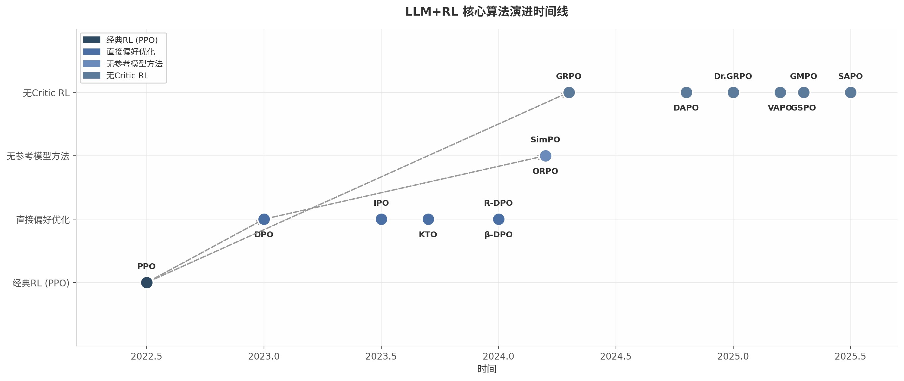
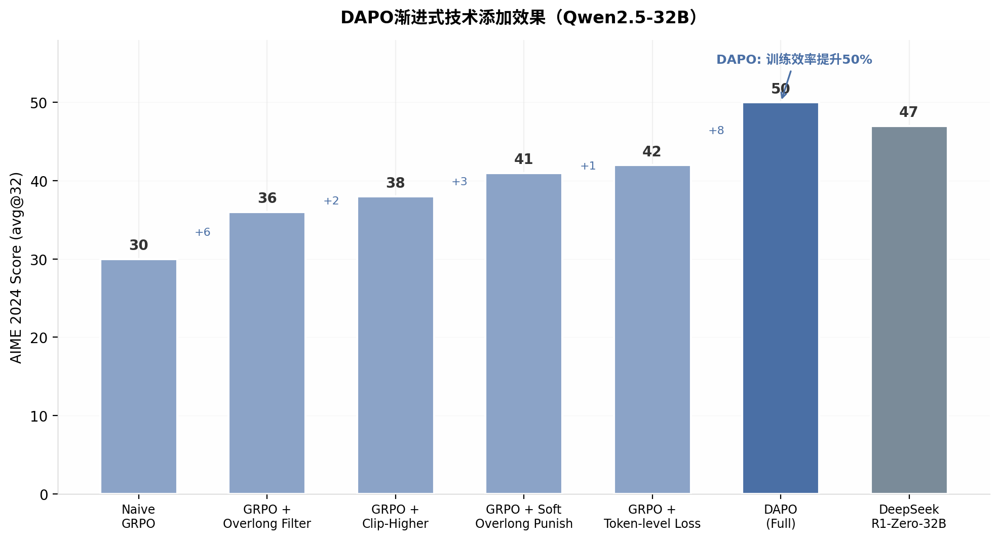
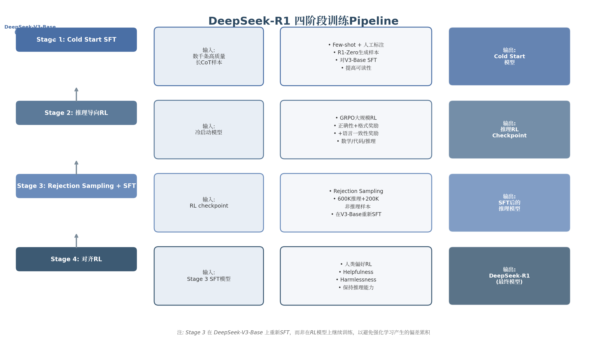
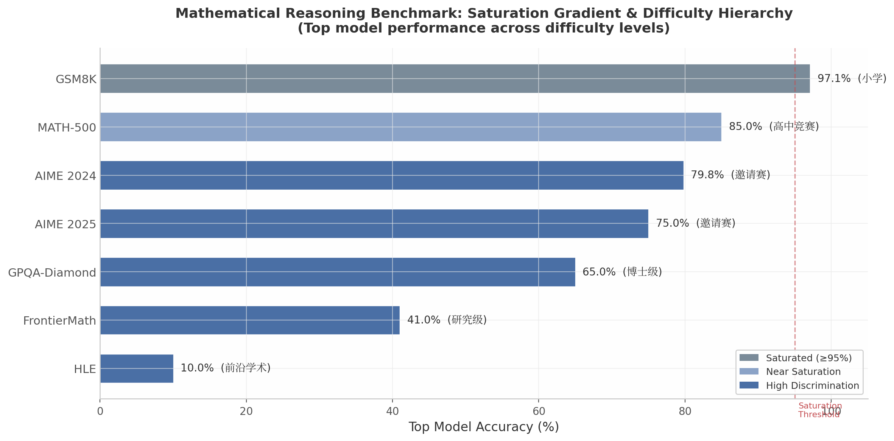
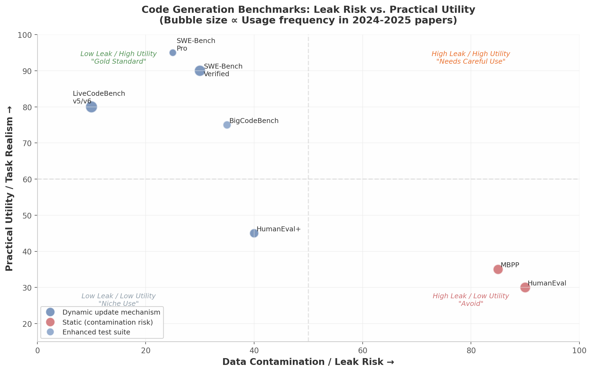
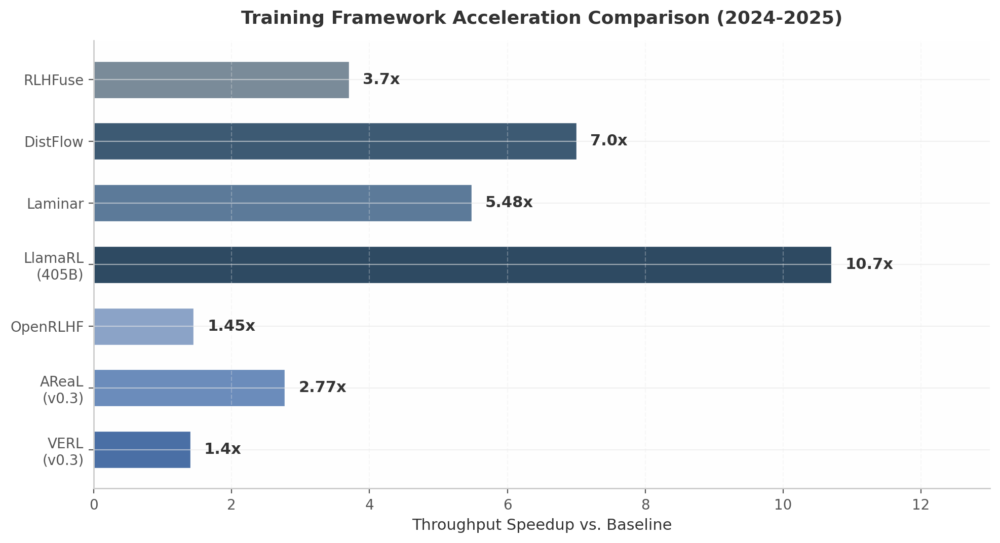
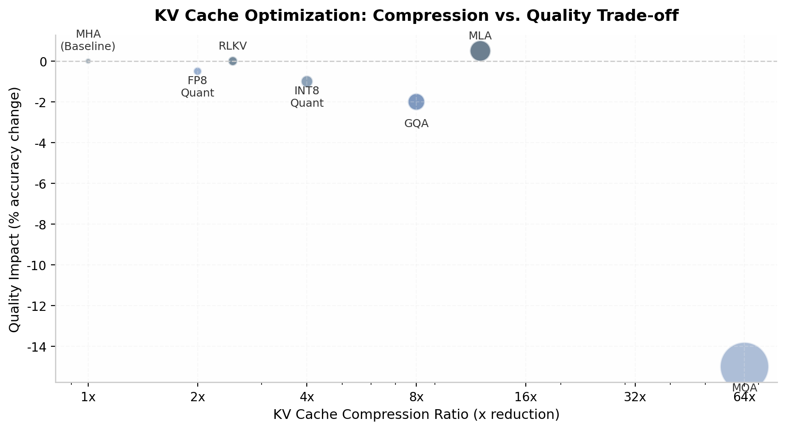
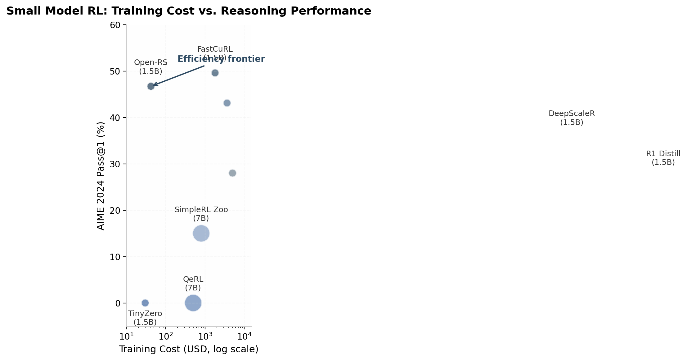

# 2024-2025年顶会大模型强化学习论文深度调研

> **副标题**: 方法、Benchmark与实现全景
> 
> **调研范围**: NeurIPS / ICML / ICLR / ACL / EMNLP / AAAI 等顶会 2024-2025年论文
> 
> **生成日期**: 2026-05-15

---

## 1. 研究概述与方法演进全景

### 1.1 研究背景与范围

大语言模型（Large Language Model, LLM）与强化学习（Reinforcement Learning, RL）的结合，正经历自Transformer架构问世以来最为深刻的范式变革。2022年至2025年间，该领域从基于人类反馈的强化学习（Reinforcement Learning from Human Feedback, RLHF）——需要耗资巨大的奖励模型（Reward Model, RM）标注与多阶段训练——演进至仅需单一模型、可验证奖励即可驱动的高效训练范式，催生了从1.5B到671B参数规模均可适用的统一RL框架。

本研究系统调研了2024-2025年发表于NeurIPS、ICML、ICLR、ACL等顶级会议与arXiv预印本平台上的120余篇LLM+RL论文，覆盖10个核心研究维度：核心算法（PPO、DPO、GRPO及其变体）、过程奖励模型（Process Reward Model, PRM）、基于可验证奖励的RL训练（RLVR）、自博弈（Self-Play）、Agent RL训练、Benchmark评估体系、训练框架优化、多目标对齐、课程学习以及小模型RL与推理时计算扩展。调研的核心目标是回答：**在LLM+RL领域，什么方法在什么Benchmark上、以怎样的训练配置取得了何种效果？**

研究范围尤其关注GRPO（Group Relative Policy Optimization, 组相对策略优化）及其变体算法如何在18个月内快速迭代，形成包含DAPO、Dr.GRPO、GMPO、GSPO、VAPO、SAPO等十余种变体的方法家族 [^1^][^2^][^4^][^5^][^6^]，以及RLVR范式从DeepSeek-R1-Zero到业界广泛采纳的完整过程。

### 1.2 方法演进脉络

LLM+RL方法的演进可清晰划分为三个阶段，每个阶段在算法复杂度上呈递减趋势，更在核心目标上发生了从"对齐人类偏好"到"激发模型能力"的根本性转向。

**图1.1** LLM+RL方法演进全景时间线（2022-2025），涵盖从PPO-based RLHF到DPO直接偏好优化，再到GRPO critic-free训练及DAPO变体优化的技术脉络。上半部分标注两大范式转变：从偏好对齐到能力激发、从多模型到单模型训练。

#### 1.2.1 Phase 1 (2022-2023): RLHF with PPO——多阶段训练的奠基时代

2022年，OpenAI发布的InstructGPT奠定了RLHF标准流程：通过监督微调（SFT）学习指令遵循能力，训练奖励模型学习人类偏好，最后使用近端策略优化（Proximal Policy Optimization, PPO）优化策略。该流程需同时维护四个模型——策略网络（Actor）、价值网络（Critic）、参考模型（Reference）和奖励模型（Reward Model）——显存需求约为策略模型的两倍，且PPO的超参数敏感性问题使得训练 notoriously 不稳定 [^14^]。尽管工程复杂度高，PPO-based RLHF在2022-2023年间确立了LLM后训练的标准范式。

#### 1.2.2 Phase 2 (2023-2024): 直接偏好优化DPO系列——去奖励模型的简化路径

2023年NeurIPS上，Rafailov等人提出的直接偏好优化（Direct Preference Optimization, DPO）从根本上改变了格局。DPO的核心洞察在于：KL约束下的奖励最大化问题的最优解与奖励函数之间存在闭式关系，可将偏好学习直接转化为策略上的二分类问题，完全消除奖励模型 [^1^]。DPO的成功催生了2024年密集的改进工作：IPO通过平方损失解决过拟合问题 [^326^]；SimPO完全移除参考模型，在AlpacaEval 2上取得40.2%的LC Win Rate [^240^]；KTO仅需二元反馈信号即可对齐 [^149^]；ORPO将SFT与偏好对齐合并为单阶段训练 [^148^]。这些变体推动了从"四模型训练"到"单模型训练"的技术精简。然而，ICML 2024的全面比较研究表明，PPO在需要强探索的复杂任务（如代码生成）上仍优于DPO [^193^]，预示了在线探索能力在后续推理RL阶段的重要性。

#### 1.2.3 Phase 3 (2024-2025): RLVR with GRPO——Critic-Free的可验证奖励训练

2024至2025年初，LLM+RL领域经历了第二次根本性范式转变。DeepSeek-AI提出的GRPO算法 [^1^]及随后在DeepSeek-R1-Zero上的成功 [^13^]，标志着RLVR（Reinforcement Learning with Verifiable Rewards）范式的正式确立。与RLHF使用人类偏好作为信号不同，RLVR使用可自动验证的结果正确性作为奖励（如数学答案、代码测试结果），奖励值仅为0或1。GRPO通过组内相对奖励归一化消除PPO中的Critic网络：对每个问题采样$G$个回答（通常$G=64$），将组内奖励标准化后作为优势函数，$\hat{A}_{i,t} = (r_i - \text{mean}(\{r_i\})) / \text{std}(\{r_i\})$ [^1^]。

DeepSeek-R1-Zero从671B参数的DeepSeek-V3-Base直接进行大规模RL训练，在AIME 2024上从基线15.6%跃升至71.0%（Pass@1），通过多数投票可达86.7% [^13^]。训练过程中模型自发涌现出长链推理、自我验证、反思乃至拟人化的"Aha Moment"——这些能力并非SFT显式教授，而是纯RL从预训练知识中"挖掘"出来的。GRPO的极简架构配合vLLM等高效推理引擎，使训练成本大幅降低：TinyZero以不到$30在1.5B模型上复现推理涌现 [^3^]，Open-RS以$42在1.5B模型上达到AIME 46.7% [^11^]。DAPO通过动态采样、非对称裁剪Clip-Higher、Token级损失归一化四项改进，将Qwen2.5-32B推至AIME 2024的50分，仅需GRPO 50%训练步数 [^2^]。

下表系统对比三个演进阶段的核心方法。

| 维度 | Phase 1: PPO (2022-2023) | Phase 2: DPO (2023-2024) | Phase 3: GRPO/RLVR (2024-2025) |
|:---|:---|:---|:---|
| 核心算法 | PPO (在线策略梯度) | DPO (离线偏好优化) | GRPO/DAPO (组相对归一化) |
| 奖励来源 | 人类偏好/奖励模型 | 成对偏好数据 | 可验证结果正确性 (0/1) |
| Critic网络 | 需要单独训练 | 不需要 | 不需要 |
| 所需模型数 | 4 (actor/critic/ref/RM) | 2 (policy + ref) | 1 (policy only) |
| 显存开销 | ~2x策略模型 | ~1.5x策略模型 | ~1x策略模型 |
| 核心优势 | 探索能力强，复杂任务优 | 简单稳定，工程友好 | 极简高效，推理涌现 |
| 主要局限 | 不稳定，资源密集 | 探索受限，长度偏差 | 零方差组，熵崩塌 |
| 代表Benchmark | AlpacaEval, HH-RLHF | MT-Bench, Arena-Hard | AIME, MATH-500, LiveCodeBench |
| 标志性成果 | InstructGPT [^14^] | DPO [^1^] | DeepSeek-R1-Zero [^13^] |

上表揭示了LLM+RL方法演进的两条核心主线。**第一条是架构精简线**：从PPO的四模型协同到DPO的两模型离线优化，再到GRPO的单模型极简训练，显存开销从约2倍降至约1倍。这反映了领域对RL在LLM场景中"真正需要什么组件"的深层认知迭代——DPO证明奖励模型可被隐式参数化，GRPO进一步证明价值网络可被组内统计量替代。**第二条是奖励信号范式转移线**：从模拟人类判断到验证客观正确性，这一转变使模型得以探索超出人类示范的解题路径，R1-Zero中涌现的反思行为正是这一自由度的直接产物。

下表从阶段特征角度进一步对比三个演进阶段。

| 特征维度 | Phase 1 (2022-2023) | Phase 2 (2023-2024) | Phase 3 (2024-2025) |
|:---|:---|:---|:---|
| **核心目标** | 对齐人类偏好 | 简化偏好优化流程 | 激发推理能力 |
| **数据类型** | 人类排序的偏好对 | 成对/二元偏好数据 | 带可验证答案的问题 |
| **数据规模** | 数万至数十万偏好对 | 数万偏好对 | 数千至数万个问题 |
| **评估指标** | 胜率, MT-Bench | LC Win Rate, Arena-Hard | Pass@1, 多数投票 |
| **训练成本** | 百万美元级 | 十万美元级 | 数十至数千美元 |
| **关键技术** | GAE, KL penalty | Bradley-Terry, 闭式奖励 | 组采样, 动态过滤, Clip-Higher |
| **超参数敏感度** | 高 | 中 | 低 (组大小G, 学习率) |
| **开源框架** | DeepSpeed, Megatron | TRL, LLaMA-Factory | VERL, AReaL, OpenRLHF |
| **社区复现难度** | 高 | 中 | 低 |

这一对比揭示了引人注目的"Less is More"趋势。Phase 3在模型组件和数据需求上均呈反向收缩——数千个可验证问题即可激发强大推理能力，训练成本从百万美元级降至数十美元级（TinyZero不到$30）[^3^]，社区复现难度大幅降低。Open-R1、SimpleRL-Zoo、TinyZero等开源项目于2025年初集中涌现，标志LLM+RL训练正从大型机构专属能力转变为全球研究社区可广泛参与的技术实践。评估体系也经历显著变迁：Phase 1-2依赖偏好模型的自动化胜率判断，存在长度偏差 [^99^]；Phase 3转向客观正确率评估，但GSM8K已达97.1%饱和，AIME每年仅30题的有限规模也带来新挑战。

### 1.3 研究核心发现概览

#### 1.3.1 从"偏好对齐"到"能力激发"的根本性范式转变

本研究最核心的发现是LLM+RL正经历从"对齐人类偏好"到"激发模型内在能力"的根本性范式转变。传统RLHF使模型输出符合人类偏好判断——本质上是主观的、基于模仿的。RLVR通过可验证奖励引导模型探索正确解空间——信号是客观的、基于发现的。DeepSeek-R1-Zero中涌现的反思、多解法尝试等行为表明，RL可从预训练模型中挖掘潜藏能力，"推理能力"可能并非新教给模型，而是通过RL从已有知识中激发出来的。

#### 1.3.2 GRPO及其变体正在成为事实上的训练标准

交叉验证数据表明，GRPO及其变体已形成LLM+RL推理训练的事实标准。从DeepSeek-R1（671B）到Open-RS（1.5B），主流推理模型在后训练阶段均采用GRPO或其衍生算法 [^1^][^2^][^5^][^6^]。框架层面，VERL（2.77x加速）、AReaL（完全异步架构）等已全面以GRPO为核心 [^327^]。2024-2025年间GRPO变体爆发式增长，本研究梳理超40种变体，涵盖偏差修正（Dr.GRPO）、稳定性增强（GMPO、SAPO）、效率优化（DAPO）和价值模型回归（VAPO，在Qwen-32B上达AIME 2024的60.4分SOTA [^6^]）等方向。超参数调优也因GRPO简洁架构而大幅简化。

#### 1.3.3 "Less is More"——中等难度样本的RL数据效率悖论

与传统深度学习"更多数据=更好性能"的直觉相反，LLM+RL中的数据筛选研究表明，少量高质量样本往往优于全量训练。LIMR仅使用16% curated数据即超越全量训练 [^4^]，FastCuRL减少50%以上训练步骤同时提升性能。SPEED-RL验证通过率约0.5的样本提供最大梯度信号——样本太容易（通过率≈1）或太难（通过率≈0）时，模型无法获得有效学习信号 [^4^]。这一悖论在RLVR中尤为突出：R1-Zero仅需数千个可验证问题即可激发强大推理能力，而传统RLHF通常需数十万偏好对。RL训练数据构建正从"大规模采集"转向"精心策划"，自动化难度评估和动态筛选正在成为标准步骤。

## 2. 核心算法体系：从PPO到GRPO

LLM（Large Language Model，大语言模型）与RL（Reinforcement Learning，强化学习）的融合经历了三次范式跃迁：从PPO（Proximal Policy Optimization，近端策略优化）主导的多阶段RLHF流程，到DPO（Direct Preference Optimization，直接偏好优化）开启的离线偏好优化时代，再到GRPO（Group Relative Policy Optimization，组相对策略优化）引领的无Critic强化学习浪潮。本章系统梳理各方法的核心公式、典型配置与适用场景，为算法选择提供定量依据。

*图2-1 LLM+RL核心算法演进时间线。自2022年PPO应用于RLHF以来，算法演进呈现三大趋势：离线化（PPO→DPO）、简化（DPO→SimPO/ORPO）和去Critic化（PPO→GRPO）。GRPO及其变体在2024年后成为推理训练的主流范式。*

### 2.1 PPO与经典RLHF

#### 2.1.1 PPO在LLM中的标准实现

PPO是OpenAI在InstructGPT [^14^] 中确立的RLHF标准算法，其标准实现采用Actor-Critic架构。Actor模型（即被训练的语言模型）负责生成响应，Critic模型（通常是与Actor同规模或更小规模的独立网络）负责评估每个状态的价值函数。两者的协同通过GAE（Generalized Advantage Estimation，广义优势估计）实现：

$$\hat{A}_t^{GAE} = \sum_{l=0}^{\infty} (\gamma\lambda)^l \delta_{t+l}^V$$

其中 $\delta_t^V = r_t + \gamma V(s_{t+1}) - V(s_t)$ 为时序差分残差，$\gamma$ 为折扣因子，$\lambda \in [0,1]$ 控制偏差-方差权衡。在LLM场景中，由于生成任务通常被视为episodic（每个序列独立），$\gamma$ 和 $\lambda$ 常被设为1 [^193^]。

PPO的核心创新在于Clipped Surrogate Objective，限制策略更新的幅度以避免训练崩溃：

$$\mathcal{L}^{CLIP}(\theta) = \mathbb{E}_t \left[ \min\left( r_t(\theta)\hat{A}_t, \ \text{clip}(r_t(\theta), 1-\epsilon, 1+\epsilon)\hat{A}_t \right) \right]$$

其中 $r_t(\theta) = \frac{\pi_\theta(a_t|s_t)}{\pi_{\theta_{old}}(a_t|s_t)}$ 为重要性采样比率，$\epsilon$ 通常为0.2。此外，KL散度约束 $\beta \cdot D_{KL}[\pi_\theta \| \pi_{ref}]$ 被添加到奖励函数中，防止策略偏离参考模型过远 [^14^]。

#### 2.1.2 ICML 2024全面对比：PPO与DPO的适用边界

Xu等人在ICML 2024发表的系统性对比研究表明，PPO在需要探索的复杂任务（如代码生成）上显著优于DPO，但训练稳定性更差 [^193^]。实验覆盖HH-RLHF（对话安全）、SafeRLHF（安全对齐）、APPS和CodeContest（代码生成）四个任务领域。结果显示，PPO在APPS和CodeContest上的pass@1分数平均高出DPO 8-12个百分点，这归因于PPO的在线采样机制允许策略在训练过程中探索超出静态偏好数据分布的新解法。相比之下，DPO在HH-RLHF等简单偏好对齐任务上收敛更快、训练更稳定，且无需维护Critic模型，工程实现更为简洁 [^193^]。

值得注意的是，PPO的训练不稳定性在超参数敏感性和奖励黑客（reward hacking）方面表现突出——不当的KL系数可能导致策略过早收敛到次优解，而优势估计的方差在序列长度超过512 tokens时显著增大 [^229^]。

#### 2.1.3 典型配置

基于ICML 2024的大规模实验和后续开源实现（如OpenRLHF [^327^]、TRL），PPO在LLM训练中的典型超参数配置如下表所示：

**表2-1 PPO在LLM训练中的典型超参数配置**

| 参数 | 典型设置 | 说明 |
|------|----------|------|
| Actor学习率 | $1\times10^{-5}$ [^193^] | 通常高于Critic以加速策略更新 |
| Critic学习率 | $5\times10^{-6}$ [^193^] | 较低学习率稳定价值估计 |
| GAE $\lambda$ | 1.0 [^193^] | LLM生成任务通常设为1（无折扣） |
| 折扣因子 $\gamma$ | 1.0 [^193^] | Episodic任务无时间折扣 |
| KL系数 $\beta$ | 0.01-0.1 [^193^] | 0.1为常见默认值，控制与参考模型的偏离 |
| 全局Batch Size | 512 [^193^] | 含多个prompt的采样结果 |
| 裁剪阈值 $\epsilon$ | 0.2 [^14^] | PPO标准设置 |
| 采样温度 | 1.0 [^193^] | 训练时采样温度 |
| Top-k | 200 [^193^] | 限制采样空间 |
| 奖励裁剪 | 20 [^193^] | 防止极端奖励值 |
| 最大生成长度 | 256-1024 [^193^] | 对话任务256，代码任务1024 |
| 训练Epoch | 3-5 [^193^] | 视数据量调整 |

该配置在7B-13B参数规模的模型上经过广泛验证 [^193^]。其中最关键的超参数是KL系数$\beta$：当$\beta$过小时策略可能快速偏离参考模型导致奖励黑客；过大则策略更新缓慢，难以获得显著提升。ICML 2024的实验建议$\beta=0.1$作为安全起点，根据任务复杂度向下调整 [^193^]。

### 2.2 DPO及其变体家族

#### 2.2.1 DPO核心公式：偏好学习作为分类问题

DPO是RLHF领域的里程碑式工作，其核心洞察在于：KL正则化奖励最大化问题的最优策略与奖励函数之间存在闭式关系 [^74^]。通过反转该关系，DPO用策略参数化奖励函数，将原本需要奖励模型和在线采样的两阶段训练简化为单阶段离线优化。

DPO的隐式奖励函数定义为：

$$r(x, y) = \beta \log \frac{\pi_\theta(y|x)}{\pi_{ref}(y|x)}$$

其中 $\pi_\theta$ 为策略模型，$\pi_{ref}$ 为参考模型（通常为SFT后的模型），$\beta$ 为温度参数控制策略偏离参考模型的程度。基于Bradley-Terry模型，DPO将偏好学习转化为二分类问题，目标是最大化首选响应（win）相对于非首选响应（lose）的log-likelihood margin：

$$\mathcal{L}_{DPO} = -\mathbb{E}_{(x, y_w, y_l) \sim D} \left[ \log \sigma\left( \beta \log \frac{\pi_\theta(y_w|x)}{\pi_{ref}(y_w|x)} - \beta \log \frac{\pi_\theta(y_l|x)}{\pi_{ref}(y_l|x)} \right) \right]$$

该公式的优雅之处在于：无需显式训练奖励模型，偏好数据直接驱动策略更新。$\beta$参数的典型值为0.1，数据质量较低时可增大至0.3-0.5以加强正则化 [^74^]。

然而，DPO存在三个已知局限。其一，长度偏差：DPO倾向于增加chosen响应的likelihood，而chosen响应通常更长，导致模型倾向于生成冗长输出 [^99^]。其二，参考模型开销：训练期间需同时加载策略模型和参考模型，显存需求翻倍。其三，过拟合风险：在确定性偏好数据上（即win和lose之间的差距始终一致），DPO可能发生过拟合导致策略崩溃 [^326^]。

#### 2.2.2 DPO改进版：R-DPO、IPO与$\beta$-DPO

针对DPO的局限，2024年涌现出一系列改进方法。**R-DPO**（Regularized DPO，ACL 2024 Findings）通过在目标函数中添加长度归一化正则化项，显式解耦响应长度与质量的影响 [^99^]：

$$\mathcal{L}_{R\text{-}DPO} = -\mathbb{E} \left[ \log \sigma\left( \beta \log \frac{\pi_\theta(y_w|x)}{\pi_{ref}(y_w|x)} - \beta \log \frac{\pi_\theta(y_l|x)}{\pi_{ref}(y_l|x)} - \alpha(|y_w| - |y_l|) \right) \right]$$

其中$\alpha$为长度正则化系数，典型值0.05-1.0。实验表明，R-DPO在MT-Bench和AlpacaEval上能在不牺牲质量的前提下显著减少冗长生成的倾向 [^99^]。

**IPO**（Identity Preference Optimization，AISTATS 2024）从理论上统一了RLHF和DPO，提出$\Psi$PO通用框架，将DPO和PPO视为特例 [^326^]。IPO使用平方损失替代DPO的logistic损失，有效避免了确定性偏好数据上的过拟合问题：

$$\mathcal{L}_{IPO} = \mathbb{E} \left[ \left( \log \frac{\pi_\theta(y_w|x)}{\pi_{ref}(y_w|x)} - \log \frac{\pi_\theta(y_l|x)}{\pi_{ref}(y_l|x)} - \frac{1}{2\beta} \right)^2 \right]$$

$\beta$在IPO中的含义与DPO不同，典型值更小（0.01-0.1），因为平方损失对large margin的惩罚更强烈 [^326^]。

**$\beta$-DPO**则从另一个角度切入，发现最优$\beta$值随批次级别数据的信息量动态变化，提出根据数据质量自适应调整$\beta$的机制 [^187^]。其核心思想是：高信息量偏好对（模型预测与标签不一致）应使用较小$\beta$以允许更大更新，低信息量对则使用较大$\beta$以加强正则化。

#### 2.2.3 简化方法：SimPO与ORPO

SimPO（Simple Preference Optimization，NeurIPS 2024/ICLR 2025）完全移除了参考模型，使用长度归一化的平均log概率作为奖励函数 [^240^]：

$$r_{SimPO}(x,y) = \frac{\beta}{|y|} \sum_{t=1}^{|y|} \log \pi_\theta(y_t | x, y_{<t})$$

$$\mathcal{L}_{SimPO} = -\mathbb{E} \left[ \log \sigma\left( r_{SimPO}(x, y_w) - r_{SimPO}(x, y_l) - \gamma \right) \right]$$

其中$\gamma$为目标奖励间隔（target reward margin），典型值为$\gamma/\beta \in [0.3, 1.6]$。SimPO解决了DPO隐式奖励与生成阶段实际使用指标之间的错位问题——DPO的奖励是policy与reference的log-ratio，而实际生成使用average log-likelihood [^240^]。实验显示，Llama-3-8B-Instruct配合SimPO在AlpacaEval 2上达到40.2% LC Win Rate，相比DPO提升2-5个百分点，同时生成更短、更少冗余的输出 [^240^]。

ORPO（Odds Ratio Preference Optimization，EMNLP 2024）将SFT和偏好对齐合并为单阶段训练，使用odds ratio惩罚项 [^148^]：

$$\mathcal{L}_{ORPO} = \mathcal{L}_{SFT} - \lambda \cdot \mathbb{E} \left[ \log \sigma\left( \beta \log \frac{\text{odds}_{\pi_\theta}(y_w|x)}{\text{odds}_{\pi_\theta}(y_l|x)} \right) \right]$$

其中$\text{odds}_{\pi}(y|x) = \pi(y|x) / (1 - \pi(y|x))$。ORPO的核心洞察是：SFT本身对于偏好对齐的成功收敛至关重要，只需对不喜欢的生成样式施加轻微惩罚即可 [^148^]。

#### 2.2.4 KTO：二元反馈信号即可匹配DPO性能

KTO（Kahneman-Tversky Optimization）基于前景理论，仅需二元信号（"好"/"坏"）即可进行对齐，无需成对偏好数据 [^149^]。KTO的效用函数直接最大化生成结果的价值：

$$\mathcal{L}_{KTO} = \mathbb{E}_{(x,y)\sim D} \left[ w(y) \cdot \left(1 - v_{KTO}(x,y) \right) \right]$$

其中$v_{KTO} = \sigma(r_{KTO}(x,y) - z_{ref})$对期望输出，$v_{KTO} = \sigma(z_{ref} - r_{KTO}(x,y))$对非期望输出，$r_{KTO}(x,y) = \beta \log(\pi_\theta(y|x)/\pi_{ref}(y|x))$，$z_{ref}$为参考点。KTO的数据效率极高——可利用成对偏好数据中的单个响应或仅有二元标签的数据，在1B到30B参数规模上匹配或超过DPO性能 [^149^]。

**表2-2 DPO及其变体算法对比**

| 方法 | 年份 | 核心创新 | 优势 | 局限 | 典型超参数 |
|------|------|----------|------|------|------------|
| DPO [^74^] | NeurIPS 2023 | 闭式奖励参数化，分类损失 | 简单稳定，无需奖励模型 | 长度偏差，参考模型开销，过拟合 | $\beta$=0.1，lr=1e-6，bs=32-512 |
| R-DPO [^99^] | ACL 2024 | 长度归一化正则化 | 减少冗长生成长度 | 引入额外超参数$\alpha$ | $\alpha$=0.05-1.0，$\beta$=0.01-0.1 |
| IPO [^326^] | AISTATS 2024 | $\Psi$PO框架，平方损失 | 避免确定性偏好上过拟合 | 部分任务收敛较慢 | $\beta$=0.01-0.1，lr=5e-7 |
| $\beta$-DPO [^187^] | 2024 | 动态温度参数校准 | 自适应数据质量 | 额外计算开销 | 动态$\beta$调整 |
| SimPO [^240^] | NeurIPS 2024 | 无参考模型，长度归一化奖励 | 更简单高效，与生成目标对齐 | $\gamma$超参数敏感 | $\beta$=2.0-10，$\gamma/\beta$=0.3-1.6 |
| ORPO [^148^] | EMNLP 2024 | SFT+PO单阶段，odds ratio | 无需参考模型和SFT预热 | 偏好信号较弱 | $\beta$=0.1，$\lambda$=1.0，lr=5e-7 |
| KTO [^149^] | 2024 | 前景理论，二元信号 | 数据获取最容易，处理不平衡数据 | 依赖前景理论假设 | $\beta$=0.1，lr=1e-5，bs=8 |

上表揭示了一条清晰的简化路径：从DPO需要参考模型和偏好对，到SimPO/ORPO去除参考模型，再到KTO仅需二元反馈。每一步简化都伴随着工程效率的提升，但在特定场景下也有性能折衷。研究表明，SimPO在AlpacaEval等对话评估上表现最佳，KTO在数据受限场景下最具优势，而IPO在高确定性偏好数据上最稳定 [^240^] [^149^] [^326^]。

### 2.3 GRPO：Critic-Free的革命

#### 2.3.1 GRPO核心机制：组内相对奖励归一化

GRPO由DeepSeek-AI在DeepSeekMath论文中提出 [^1^]，其核心创新在于完全消除了PPO中需要单独训练的Critic网络。GRPO针对每个问题$q$采样一组回答$\{o_i\}_{i=1}^G$，通过组内相对奖励计算优势函数：

$$\hat{A}_{i} = \frac{r_i - \text{mean}(\{r_i\}_{i=1}^G)}{\text{std}(\{r_i\}_{i=1}^G)}$$

其中$G$为组大小（group size），$r_i$为第$i$个回答的奖励（对于数学推理通常为答案正确性的二值信号）。该优势函数对组内所有回答的奖励进行标准化（减去均值、除以标准差），并将同一优势值赋给回答中每个token [^1^]。这一设计的直觉在于：对于同一问题，一组回答中表现相对较好的应被鼓励，表现相对较差的应被抑制——无需外部价值模型提供绝对评估。

GRPO的完整目标函数为：

$$\mathcal{J}_{GRPO}(\theta) = \mathbb{E}_{q, \{o_i\}} \left[ \frac{1}{G} \sum_{i=1}^{G} \frac{1}{|o_i|} \sum_{t=1}^{|o_i|} \min\left( \rho_{i,t}\hat{A}_i, \ \text{clip}(\rho_{i,t}, 1-\epsilon, 1+\epsilon)\hat{A}_i \right) - \beta D_{KL}[\pi_\theta \| \pi_{ref}] \right]$$

其中$\rho_{i,t} = \pi_\theta(o_{i,t}|q, o_{i,<t}) / \pi_{\theta_{old}}(o_{i,t}|q, o_{i,<t})$为token级重要性采样比率。与PPO的关键区别在于：GRPO将KL散度在loss函数中显式添加，而非PPO中在奖励函数中隐式处理 [^1^]。

#### 2.3.2 DeepSeekMath原始实验

GRPO的原始实验在DeepSeekMath-Instruct 7B模型上进行，使用144K条GSM8K和MATH的chain-of-thought问题数据，关键超参数包括：学习率$1\times10^{-6}$，KL系数$\beta=0.04$，组大小$G=64$，最大序列长度1024 tokens [^1^]。训练后的模型在多个数学推理基准上取得显著提升：

| Benchmark | Instruct基线 | GRPO训练后 | 绝对提升 |
|-----------|-------------|-----------|----------|
| GSM8K | 82.9% [^1^] | 88.2% [^1^] | +5.3pp |
| MATH | 46.8% [^1^] | 51.7% [^1^] | +4.9pp |
| CMATH | 84.6% [^1^] | 88.8% [^1^] | +4.2pp |

这些结果在当时代表了7B级别开源模型的数学推理新SOTA，更重要的是证明了无需Critic模型的强化学习在LLM训练中的可行性。

#### 2.3.3 GRPO vs PPO系统性对比

**表2-3 GRPO与PPO系统性对比**

| 对比维度 | PPO | GRPO | 影响 |
|----------|-----|------|------|
| Critic网络 | 需要单独训练 | 不需要（组内归一化替代） | GRPO内存减半 |
| 模型数量 | 4个（actor/critic/reference/reward） | 2个（policy/reference） | GRPO工程复杂度大幅降低 |
| 优势估计 | GAE + Value Model | 组内相对归一化 | GRPO无需价值函数学习 |
| 内存消耗 | ~2倍模型参数 | ~1倍模型参数 | GRPO可使用更大batch或更大模型 |
| KL散度 | 在奖励函数中隐式添加 | 在loss函数中显式添加 | GRPO KL控制更直接 |
| 在线采样 | 需要实时奖励模型评估 | 仅需要可验证奖励 | GRPO适合可验证任务（数学/代码） |
| 训练稳定性 | 超参数敏感，容易崩溃 | 更稳定，但存在熵崩塌风险 | 两者均需 careful tuning |
| 适用任务 | 通用偏好对齐 | 可验证推理任务 | 任务类型决定方法选择 |

GRPO相比PPO的核心优势在于资源效率：省去Critic模型意味着显存消耗减半，无需训练Value model意味着减少了超参数调优空间。然而，GRPO并非在所有场景下都优于PPO。GRPO依赖组内回答的方差来获取学习信号——当所有回答都正确或都错误时（即零方差组），梯度信号消失，这是DAPO等后续改进重点解决的问题 [^2^]。此外，PPO在需要精细偏好建模的开放域对话任务上仍具优势，因为这类任务难以获得简单的二值可验证奖励。

### 2.4 GRPO变体算法群

GRPO的成功催生了大量变体算法，形成了一个活跃的改进方向。这些变体围绕六个核心挑战展开：熵崩塌、零方差组、长度偏差、离群值敏感、MoE（Mixture of Experts，混合专家模型）兼容性和Value model需求。

#### 2.4.1 DAPO：四大改进推动训练效率提升50%

DAPO（Decoupled Clip and Dynamic Sampling Policy Optimization）是当前GRPO最具影响力的变体之一 [^2^]，通过四项关键技术使Qwen2.5-32B在AIME 2024上达到50分，仅需GRPO约50%的训练步数。

**改进一：Dynamic Sampling（动态采样）**。过滤掉所有回答都正确或都错误的"零方差组"，确保每个batch中所有prompt都有有效梯度信号。约束条件为$0 < |\{o_i \mid \text{is\_equivalent}(a, o_i)\}| < G$ [^2^]。

**改进二：Clip-Higher（非对称裁剪）**。将裁剪上下界解耦为$\epsilon_{low}=0.20$和$\epsilon_{high}=0.28$，允许更大的正向策略更新幅度，有效缓解熵崩塌：

$$\text{clip}\left(\rho_{i,t}, \ 1-\epsilon_{low}, \ 1+\epsilon_{high}\right)$$

**改进三：Token-Level Policy Gradient Loss**。用总token数归一化损失，替代GRPO中按序列数归一化：

$$\mathcal{J}_{DAPO} = \mathbb{E} \left[ \frac{1}{\sum_{i=1}^{G}|o_i|} \sum_{i=1}^{G} \sum_{t=1}^{|o_i|} \min\left( \rho_{i,t}\hat{A}_{i}, \ \text{clip}(\rho_{i,t}, 1-\epsilon_{low}, 1+\epsilon_{high})\hat{A}_{i} \right) \right]$$

**改进四：Overlong Reward Shaping（过长奖励塑形）**。对超过预设长度阈值的回答施加soft惩罚，鼓励生成足够长的CoT（Chain-of-Thought，思维链）以容纳完整推理过程，但避免过度冗长 [^2^]。

*图2-2 DAPO渐进式技术添加效果。从Naive GRPO的30分出发，每一步改进都带来稳定提升：过长过滤+6分、非对称裁剪+2分、Soft过长惩罚+3分、Token级损失+1分、动态采样+8分，最终达到50分，超越DeepSeek-R1-Zero-Qwen-32B的47分 [^2^]。*

#### 2.4.2 Dr.GRPO：长度归一化修正

Dr.GRPO识别出GRPO中两个导致训练偏差的源头 [^3^]。**长度偏差**：GRPO对每个回答的损失除以$|o_i|$（回答长度），导致长回答中每个token的梯度被缩小，模型倾向于生成更长但不一定更好的回答。**标准差偏差**：除以组内标准差使得问题难度影响梯度大小，极端奖励分布的问题被过度加权。

Dr.GRPO的修正方案是直接移除$\frac{1}{|o_i|}$和$\text{std}(R)$两项归一化，优势函数简化为：

$$\hat{A}_i = r_i - \text{mean}(R)$$

使用7B模型在AIME 2024上达到43.3%，显著优于GRPO基线 [^3^]。Dr.GRPO的优势在于实现简单——仅需修改几行代码即可从GRPO升级，同时有效提升token效率。

#### 2.4.3 GMPO/GSPO：几何平均与序列级优化

**GMPO**（Geometric-Mean Policy Optimization）用几何平均替代GRPO中的算术平均来聚合token级奖励 [^4^]：

$$\mathcal{J}_{GMPO}(\theta) = \mathbb{E}\left[\left(\prod_{t=1}^{|o_i|} \rho_{i,t} \cdot \mathbf{1}_{[\text{unclipped}]}\right)^{\frac{1}{|o_i|}} \cdot \hat{A}_i \right]$$

等价于对数空间中的平均：$\log \mathcal{J}_{GMPO} \propto \frac{1}{|o_i|} \sum_{t=1}^{|o_i|} \log \rho_{i,t}$。几何平均对离群值不敏感（outlier robust），使重要性采样比率的范围更稳定，允许使用更宽的裁剪阈值而不失去稳定性 [^4^]。GMPO-7B在AIME 2024、AMC、MATH-500等多个数学基准上平均超越GRPO 4.1个百分点。

**GSPO**（Group Sequence Policy Optimization）则从另一维度改进——将优化粒度从token级提升到序列级 [^5^]。GSPO定义序列级重要性比率：

$$s_i(\theta) = \exp\left( \frac{1}{|y_i|} \sum_{t=1}^{|y_i|} \log \frac{\pi_\theta(y_{i,t}|x, y_{i,<t})}{\pi_{\theta_{old}}(y_{i,t}|x, y_{i,<t})} \right)$$

并对整个序列统一裁剪：$\mathcal{J}_{GSPO} = \mathbb{E} [ \min(s_i\hat{A}_i, \ \text{clip}(s_i, 1-\epsilon, 1+\epsilon)\hat{A}_i) ]$。GSPO是Qwen3模型RL训练的核心算法，在MoE模型上展现出显著优于GRPO的训练稳定性 [^5^]。

#### 2.4.4 其他变体：VAPO、SAPO、M-GRPO、Lambda-GRPO

**VAPO**（Value-based Augmented Proximal Policy Optimization）是唯一回归使用Value model的变体，通过Value Pretraining（用reward model初始化value model）避免了vanilla PPO中value model学习崩塌的问题 [^6^]。VAPO还引入解耦GAE、自适应GAE、正例LM损失和组采样等七项改进，在Qwen-32B上达到AIME 2024的60.4分新SOTA [^6^]。消融实验显示，仅正例LM损失一项就贡献6分提升，证明在RL训练中维持正样本的likelihood至关重要。

**SAPO**（Soft Adaptive Policy Optimization）用平滑、温度控制的门控函数替代硬裁剪，通过Sigmoid函数实现token级自适应衰减 [^7^]。其核心设计哲学是对正优势token允许更大更新幅度，对负优势token施加更严格约束，非对称温度设计进一步区分正负token的处理。

**M-GRPO**使用缓慢演变的momentum模型提供稳定训练目标，结合IQR自适应过滤方法动态剪除低熵轨迹，解决长程训练中的策略崩塌问题 [^10^]。**Lambda-GRPO**通过可学习token偏好参数统一GRPO框架，动态调整长度惩罚和偏好权重 [^11^]。

**表2-4 GRPO变体算法系统性对比**

| 方法 | 年份 | 核心创新 | 解决的核心问题 | 局限 | 典型超参数 |
|------|------|----------|--------------|------|------------|
| GRPO [^1^] | 2024 | 组内相对归一化 | 无需Critic | 熵崩塌，零方差，长度偏差 | $G$=64，$\beta$=0.04，lr=1e-6 |
| DAPO [^2^] | 2025 | 动态采样+Clip-Higher+Token级损失+过长惩罚 | 零方差，熵崩塌，训练效率 | 实现复杂度中等 | $\epsilon_{low}$=0.20，$\epsilon_{high}$=0.28，KL=0 |
| Dr.GRPO [^3^] | 2025 | 移除长度/std归一化 | 长度偏差，难度偏差 | 标准差信息丢失 | $G$=8-16，lr=1e-6 |
| GMPO [^4^] | 2025 | 几何平均替代算术平均 | 离群值敏感 | 实现需特殊处理 | $G$=8-16，lr=1e-6 |
| GSPO [^5^] | 2025 | 序列级重要性比率与裁剪 | MoE兼容，熵稳定 | 信息粒度较粗 | $G$=8-16，lr=1e-6 |
| VAPO [^6^] | 2025 | Value预训练+7项改进 | Value崩塌，长CoT | 需维护Critic，复杂度高 | Actor lr=1e-6，Critic lr=2e-6 |
| SAPO [^7^] | 2025 | 软门控替代硬裁剪 | 硬裁剪信号丢失 | 温度参数需调 | $\tau_{pos}$/$\tau_{neg}$非对称 |
| M-GRPO [^10^] | 2025 | Momentum锚定+IQR过滤 | 长程策略崩塌 | Momentum更新频率 | Momentum decay=0.99 |
| Lambda-GRPO [^11^] | 2025 | 可学习token偏好参数 | 统一框架 | 额外参数量 | 可学习$\lambda$参数 |

### 2.5 方法选择决策框架

#### 2.5.1 场景-方法匹配

基于上述分析，以下决策框架帮助研究者根据任务特性选择最合适的算法：

**表2-5 场景-方法匹配决策表**

| 应用场景 | 推荐方法 | 备选方法 | 不推荐方法 | 关键考量 |
|----------|----------|----------|------------|----------|
| 通用偏好对齐（对话/指令跟随） | SimPO [^240^] | DPO [^74^], KTO [^149^] | GRPO | SimPO无参考模型且与生成目标对齐 |
| 数学/科学推理训练 | DAPO [^2^] | GRPO [^1^], Dr.GRPO [^3^] | PPO | 需可验证奖励信号；DAPO效率最高 |
| 代码生成与验证 | GRPO/DAPO | PPO [^193^] | DPO/SimPO | PPO在复杂代码探索上仍有优势 |
| 多目标对齐（安全+有用） | MODPO [^105^] | MO-ODPO [^97^] | 单一目标方法 | 需Pareto最优trade-off |
| 数据极度受限（仅二元标签） | KTO [^149^] | - | DPO/SimPO | KTO仅需二元信号 |
| 长链推理（30K+ tokens） | VAPO [^6^] | DAPO [^2^] | 标准GRPO | VAPO的Value model对长CoT有帮助 |
| MoE模型训练 | GSPO [^5^] | SAPO [^7^] | GRPO | 序列级优化对MoE更稳定 |
| 快速原型验证/资源受限 | Dr.GRPO [^3^] | GRPO [^1^] | VAPO/PPO | Dr.GRPO实现最简单 |
| 端到端单阶段训练 | ORPO [^148^] | CPO [^85^] | DPO | ORPO合并SFT和偏好优化 |

该框架的核心理念是：**任务类型决定方法选择**。对于可验证的推理任务（数学、代码），GRPO系列方法因无需人工标注偏好数据且训练高效而成为首选；对于开放域的偏好对齐任务（对话质量、风格调整），DPO系列方法因更贴合人类主观偏好评估而更适合 [^193^] [^1^]。

#### 2.5.2 各方法Benchmark覆盖矩阵与性能边界

**表2-6 核心算法Benchmark覆盖矩阵**

| 方法 | AlpacaEval 2 | MT-Bench | GSM8K | MATH-500 | AIME 2024 | 代码生成 |
|------|-------------|----------|-------|----------|-----------|----------|
| PPO | 中等 | 中等 | - | - | - | **优** [^193^] |
| DPO | 良好 | 良好 | - | - | - | 差 |
| SimPO | **40.2%** [^240^] | 良好 | - | - | - | 差 |
| ORPO | 12.20% [^148^] | 7.32 | - | - | - | 差 |
| KTO | 匹配DPO [^149^] | 匹配DPO | - | - | - | 差 |
| GRPO | - | - | 88.2% [^1^] | 51.7% [^1^] | ~30 | 良好 |
| DAPO | - | - | - | - | **50** [^2^] | 良好 |
| Dr.GRPO | - | - | - | - | 43.3 [^3^] | 良好 |
| VAPO | - | - | - | - | **60.4** [^6^] | 良好 |
| GMPO | - | - | +4.1% [^4^] | +4.1% [^4^] | +4.1% [^4^] | 良好 |

上表中的数据揭示了算法性能与评估任务之间的结构性关联。偏好优化方法（DPO/SimPO/ORPO/KTO）在对话评估基准（AlpacaEval、MT-Bench）上表现突出，但在需要多步推理的数学基准上几乎无覆盖。相反，GRPO系列方法专注于数学推理基准，在GSM8K和AIME上取得显著进展。这种"任务-方法绑定"现象说明当前LLM+RL领域已形成两个相对独立的技术生态：偏好对齐生态以DPO系列为核心，推理训练生态以GRPO系列为核心 [^1^] [^74^]。

值得注意的是，VAPO在AIME 2024上达到的60.4分是目前公开报告中的最高分 [^6^]，但这一结果依赖于Value model的使用，增加了训练复杂度。对于大多数实际应用场景，DAPO以更低的实现复杂度（无需Value model）提供了极具竞争力的性能——50分在Qwen2.5-32B上超越DeepSeek-R1-Zero-Qwen-32B的47分 [^2^]，且训练步数仅为GRPO的50%。对于资源受限的研究者，Dr.GRPO仅需修改GRPO的几行归一化代码即可获得约43.3分的强基线结果 [^3^]，是性价比最高的入门选择。

## 3. 过程奖励模型与信用分配

信用分配（Credit Assignment, CA）是LLM强化学习训练中的核心机制。当模型生成长达30K tokens的推理链时，最终答案的正确或错误必须被精确归因到序列中的各个位置——是初始理解错误，还是中间某步计算失误，抑或仅是最终表达疏忽？这一归因过程的精确度直接决定了策略梯度更新的有效性。研究表明，在单轮推理中信用分配已趋于成熟，而在多轮Agent交互中仍面临随机环境、部分可观察性和非可验证中间状态等根本性挑战 [^1^]。

### 3.1 过程监督基础

#### 3.1.1 PRM vs ORM：从结果到过程的范式转移

过程奖励模型（Process Reward Model, PRM）与结果奖励模型（Outcome Reward Model, ORM）的分野构成了LLM强化学习信用分配研究的方法论起点。PRM对推理链的每一步输出一个标量奖励信号，而ORM仅对最终答案进行评估。OpenAI在2023年发表的"Let's Verify Step by Step"通过人工标注80万步级标签构建了PRM800K数据集，首次以大规模实验证明PRM在best-of-K选择中显著优于ORM（78.2% vs 72.4% vs 69.6%多数投票），奠定了过程监督的实证基础 [^2^] [^24^]。

**表1：PRM与ORM核心属性对比**

| 维度 | ORM（结果奖励模型） | PRM（过程奖励模型） |
|:---|:---|:---|
| 监督粒度 | 仅评估最终答案 | 每步/每token评估 |
| 标注成本 | 低（仅需最终结果标签） | 高（需步级标签，人工约$1-2/步 [^5^]） |
| 信用分配密度 | 稀疏，延迟反馈 | 密集，即时反馈 |
| 奖励黑客风险 | 较低 | 较高（可能优化表面正确性） |
| 推理可解释性 | 低（无法定位错误） | 高（可精确到错误步） |
| 测试时扩展能力 | 弱（仅选最终答案） | 强（可引导搜索/剪枝） |
| 适用场景 | 短推理、可验证任务 | 长推理、多步复杂任务 |
| 代表方法 | GRPO、PPO | PURE、VinePPO、SPO |

PRM的优势在需要长链推理的竞赛级数学问题上尤为突出：PRM能够引导树搜索中的剪枝决策，因其步级信号可以识别并排除错误分支 [^6^]。然而，PRM的高标注成本长期制约其扩展性——人工标注每步正确性的成本约为最终结果标注的50-75倍 [^5^]。ORM虽然在简单任务上表现足够，但当推理链超过一定长度时，稀疏的终端反馈无法为中间步骤提供有效的学习信号。值得指出的是，DeepSeek-R1的实验表明纯ORM配合大规模RL训练也能激发强推理能力，这意味着PRM并非必要条件，而是在特定场景下提升训练效率和最终性能的有力工具 [^1^]。

#### 3.1.2 自动化标注：Math-Shepherd与OmegaPRM

PRM标注成本问题的首个系统性解决方案来自Math-Shepherd（ACL 2024）。该方法对每个推理步骤进行蒙特卡洛（Monte Carlo, MC）采样：从当前步出发独立采样多条后续轨迹，计算到达正确答案的比例作为该步的过程监督分数 [^3^]。Math-Shepherd以Mistral-7B为基座模型，在GSM8K和MATH基准上验证了自动标注PRM的可行性，但其采样成本仍然较高——每步需数十条完整rollout才能获得稳定的估计。

OmegaPRM（2024）通过引入分治式蒙特卡洛树搜索（MCTS）结合二分搜索策略，显著降低了标注开销。该方法将定位推理链中首个错误步的问题建模为树搜索过程，通过优先探索高不确定性区域，在保持标注质量的同时将成本降低约75倍 [^4^] [^5^]。OmegaPRM使用Gemini Pro模型自动生成超过150万过程监督标注，将MATH500上的表现从51%提升至69.4%，GSM8K达到93.6% [^4^]。AlphaMath（2024）则采用了更为激进的策略——从结果监督直接推导伪过程监督标签，完全消除了步级标注需求，但引入了标注噪声与推理质量之间的权衡 [^2^] [^25^]。

#### 3.1.3 隐式PRM：PRIME的在线学习路径

PRIME（Process Reinforcement through Implicit Rewards, 2025）代表了一种根本不同的PRM构建思路：无需任何显式过程标注，而是从策略模型和参考模型的对数似然比中推导token级别的密集奖励 [^10^]。其隐式过程奖励定义为 $r_\phi(y_t) := \beta \log \frac{\pi_\phi(y_t|y_{<t})}{\pi_{ref}(y_t|y_{<t})}$，即策略模型与参考模型在生成每个token时的概率差异。PRIME的核心优势在于策略和隐式PRM可以同时在线更新：策略通过强化学习优化，PRM通过交叉熵损失更新，两者仅需结果级标签驱动。实验表明，从Qwen2.5-Math-7B-Base出发，PRIME在多个数学和代码推理基准上平均提升15.1%，训练出Eurus-2-7B-PRIME模型 [^10^]。PRIME开创了隐式信用分配（Implicit Credit Assignment, ICA）的研究方向，为后续FreePRM和ThinkPRM等工作奠定了理论基础。

### 3.2 信用分配方法全景

信用分配方法可按监督粒度划分为四个层级：token-level、step-level、segment-level和turn-level。每个层级在计算开销与估计精度之间存在根本性权衡，适用于不同的任务场景和计算约束。

**表2：信用分配方法粒度分类全景**

| 方法 | 粒度 | 核心机制 | 需辅助模型 | 计算开销 | 精度 | 场景 |
|:---|:---|:---|:---|:---|:---|:---|
| VinePPO [^13^] | Token | 无偏MC价值估计：每token分叉K条vine rollout | 否 | 高（$O(K \cdot L)$） | 最高 | 长推理链 |
| RED [^14^] | Token | 从RM隐藏层提取token级边际贡献 | 需RM | 低（零额外RL成本） | 高 | 已有RM复用 |
| T-REG [^15^] | Token | 对比自提示生成正确/错误解的log-prob差异 | 否 | 低 | 中 | 偏好优化 |
| TEMPO [^16^] | Token/Seg | Prefix-to-Tree + branch-gated TD修正 | 否 | 中 | 高 | 短/长CoT |
| PURE [^9^] | Step | Min-form $V(s_t)=\min r_\tau$ 替代求和 | 需PRM | 中 | 高 | 竞赛数学 |
| SPRO [^17^] | Step | 从策略本身推导CPR+MSA，critic-free | 否 | 中 | 中高 | 工业部署 |
| CAPO [^26^] | Step | LLM-as-Critic生成式PRM自我批评 | 需LLM | 中 | 中 | 自包含系统 |
| ACPO [^27^] | Step | 梯度归因分解结果奖励为步级贡献 | 否 | 中 | 中 | 课程学习 |
| HICRA [^28^] | Step | 关注高影响力规划token的两阶段动态 | 否 | 中 | 中高 | 复杂推理 |
| SPO [^18^] | Segment | MC段级优势估计（chain/tree双实例） | 否 | 中 | 中高 | 通用推理 |
| SCAR [^19^] | Segment | Shapley值从合作博弈论分配边际贡献 | 否 | 高 | 高 | 通用RLHF |
| ArCHer [^29^] | Turn | 两级架构：高级off-policy critic + 低级on-policy actor | 需Critic | 中 | 中 | 多轮Agent |
| GiGPO [^20^] | Step | 两级优势：外层轨迹比较+内层anchor分组 | 否 | 低 | 中 | Agent训练 |
| SWEET-RL [^30^] | Turn | Privileged critic条件于训练时特权信息 | 需Critic | 中 | 中高 | 多轮交互 |
| AgentPRM [^21^] | Step | TD+GAE替代MC，promise+progress双评分 | 需Critic | 中 | 中高 | 工具使用Agent |

上表涵盖了从token到turn的全谱系方法。关键观察有三：其一，critic-free方法（T-REG、SPRO、GiGPO、SPO、SCAR）在2025年密集涌现，反映了工业界对低部署成本方案的强烈需求；其二，step-level方法数量最多（PURE、SPRO、CAPO、ACPO、HICRA），表明该粒度在精度与实用性之间取得了最佳平衡；其三，Agent-level方法普遍需要辅助模型（critic或privileged信息），因为多轮交互中的部分可观察性使无模型估计面临根本性困难 [^1^]。

#### 3.2.1 Token-level信用分配：最细粒度的无偏估计

VinePPO（ICML 2025）是token-level信用分配的理论最优美实现。其核心机制是在每个token位置分叉 $K$ 条独立continuation（称为"vine"），评估每条路径的最终奖励，以此构建无偏的token级价值估计：$V(s_t) \approx \frac{1}{K} \sum_{k=1}^{K} R(\tau_t^{(k)})$ [^13^]。优势函数 $\hat{A}_t = R(\tau) - V(s_t)$ 消除了critic函数逼近误差，每个token的信用完全由其后续多条路径的期望回报决定。然而，这种精确性以 $O(K \cdot L)$ 的额外前向传播为代价（$L$ 为序列长度），在长推理链上计算成本急剧上升。VinePPO的关键实证发现是：信用分配质量（而非策略优化算法本身）才是RL训练的主要瓶颈 [^1^]。

RED（Reward Redistribution, 2024）采取了截然不同的路径：从现成的奖励模型（Reward Model, RM）内部表示中提取token级奖励。具体而言，RED在RM的隐藏状态上训练一个轻量级线性probe，预测每个token对总奖励的边际贡献 [^14^]。这种方法的计算成本近乎为零——仅需一次额外的前向传播即可完成所有token的信用重分配。RED的核心发现是预训练奖励模型已编码了丰富的信用分配信息，只是未被充分利用 [^14^]。

TEMPO（2025）提供了一种介于token-level与segment-level之间的混合方案。其Prefix-to-Tree（P2T）模块将一组响应转换为前缀树结构，通过聚合所有后代节点的结果正确性计算非参数化前缀值 $V(s_t)$ [^16^]。Branch-gated TD修正在非分支token处退化为标准GRPO（TD项为零），仅在分支token处提供精确的token-level信用修正。这一设计使TEMPO无需学习价值网络、PRM或额外judge，在Qwen3-1.7B/4B上收敛速度比PPO和GRPO提升高达1.6倍 [^16^]。

#### 3.2.2 Step-level信用分配：实用性与精度的平衡

Step-level信用分配是当前研究最活跃的粒度区间，因其在标注可行性与信用精度之间取得了实际平衡。

PURE（ICML 2025）通过数学洞察解决了PRM训练中的一个根本性问题。传统PRM将价值函数定义为未来奖励之和 $V(s_t) = \sum_{\tau \geq t} r_\tau$，PURE证明这种求和形式（summation-form）会导致训练初期即出现崩溃（reward hacking）——模型可通过增加正确步数来无上限提升价值估计 [^9^]。PURE提出的min-form信用分配将价值函数重新定义为 $V(s_t) = \min_{\tau \geq t} r_\tau$，即后续步骤中的最小奖励。这一看似简单的改变从根本上限制了价值函数的范围，使优势分配更加合理。实验表明，PURE-PRM仅需30%训练步数即可达到与可验证奖励（VR）方法相当的推理性能，而PURE-PRM+VR（仅10%可验证奖励）在AMC23上达到82.5%、五个基准平均53.3% [^9^]。

CAPO（Credit Assignment Policy Optimization, 2025）开创了LLM-as-Critic范式：利用LLM自身的语义理解能力，给定推理轨迹后生成每步的自然语言批评，再将其转化为数值奖励信号 [^26^]。CAPO的优势在于完全自包含——无需单独的奖励模型、critic网络或MC rollout，但面临自我评估偏差（模型系统性高估自己步骤）的风险，需配合校准技术使用。在Qwen2.5-7B上，CAPO在MATH-500上达到31.0%（相比GRPO的27.2%提升3.8个百分点），在AIME'24上达到9.7%（相比GRPO的3.6%提升6.1个百分点）[^1^]。

HICRA（Hierarchy-Aware Credit Assignment, 2025）通过识别学习的两阶段动态来优化信用分配：模型首先获得程序性技能（常规计算模式），然后发展策略规划能力（高层问题分解）。HICRA据此将学习信号集中于高影响力规划token，而非均匀分配至所有token [^28^]。在Qwen3-4B-Instruct上，HICRA在AIME'24达到73.1%（比GRPO的68.5%提升4.6个百分点），AIME'25达到65.1%（比GRPO的60.0%提升5.1个百分点）[^28^]。

#### 3.2.3 Segment-level信用分配：中间粒度的系统设计

SPO（Segment Policy Optimization, 2025）是segment-level信用分配的代表性工作，其核心设计包含三个组件：灵活的segment分区策略、精确的segment级MC优势估计（无需critic）、以及基于segment优势的策略优化 [^18^]。SPO提供两个实例化版本：SPO-chain针对短CoT采用cutpoint-based分区配合chain-based优势估计，在GSM8K上比PPO/GRPO提升6-12个百分点；SPO-tree针对长CoT采用tree-based优势估计，大幅降低MC估计成本，在MATH500上比GRPO提升7-11个百分点。使用DeepSeek-R1-Distill-Qwen-1.5B模型，SPO在MATH-500（4K上下文）上达到82.8%，相比GRPO的75.2%提升7.6个百分点 [^18^]。

SCAR（Shapley Credit Assignment Rewards, 2025）从合作博弈论出发，使用Shapley值原理将序列级总奖励按各token/span的边际贡献进行分配 [^19^]。Shapley值的理论保证使SCAR在保持原始最优策略不变的前提下实现更公平的信用分配，无需辅助critic模型或细粒度人工标注。SCAR在情感控制、文本摘要和指令调优任务上相比标准RLHF和基于attention的dense reward基线收敛更快且最终奖励更高 [^19^]。

#### 3.2.4 Agent-level信用分配：多轮交互的分层架构

Agent-level信用分配面向多轮交互场景（如工具使用、网页导航），其中信用粒度以"轮次"（turn）为单位，一轮可包含数百至数千个token。这一层级的核心挑战来自部分可观察性和环境交互的不可重复性。

ArCHer（ICML 2024）是首个面向多轮LLM Agent的分层信用分配架构，采用显式两级设计：高级off-policy critic学习轮次级Q函数 $Q^H(s_t, a_t)$，低级on-policy actor优化轮次内的token级策略 $\pi_\theta(y|s_t)$ [^29^]。高级critic从经验回放缓冲区中学习，低级actor则以高级Q值作为轮次级奖励信号进行优化。ArCHer的架构正式认识到多轮LLM强化学习与单轮推理强化学习在信用分配机制上需要根本不同的设计 [^1^]。

GiGPO（NeurIPS 2025）将GRPO的组比较原则从轨迹级扩展到步级，是当前Agentic RL中最先进的critic-free方法。其两级优势估计在**外层**对轨迹进行分组比较（如标准GRPO），在**内层**通过anchor state grouping将共享相似前缀的步骤分组进行微观比较 [^20^]。GiGPO保持了GRPO的critic-free特性，GPU内存开销与GRPO相同，无额外LLM rollout时间成本。在ALFWorld上比GRPO提升超过12个百分点，WebShop上提升超过9个百分点 [^20^]。

SWEET-RL（Meta/FAIR, 2025）引入了**特权critic**（privileged critic）的概念，利用训练时可获得但推理时无法获取的信息（ground truth答案、完整未来轨迹、环境状态变量）训练critic，使其提供高质量的轮次级奖励信号 [^30^]。actor则通过DPO式优化仅看到标准观测。这一设计优雅地绕过了中间状态不可验证的挑战，在多轮交互任务上展示了显著优势。

AgentPRM（2025）证明在Agent环境中MC标注过于昂贵——每次标注都需要重新执行环境交互。其替代方案是使用TD学习配合GAE训练步级critic：$V(s_t) \leftarrow V(s_t) + \alpha[r_t + \gamma V(s_{t+1}) - V(s_t)]$，并引入"promise"（成功可能性）和"progress"（步间进展）双评分机制。AgentPRM比MC-based PRM训练高出8倍样本效率 [^21^]。

**图1：信用分配方法的计算开销与精度权衡**。横轴为计算成本相对值（以对数代理度量），纵轴为信用分配精度代理值。不同形状代表不同粒度层级（圆圈=token级，方块=step级，菱形=segment级，三角=turn级）。帕累托前沿线（虚线）连接了各计算预算下的最优方法。GRPO作为基线位于左下角，VinePPO位于右上角。值得注意的是，step-level方法（如PURE、SPRO）在平衡区密集分布，反映了该粒度区间在精度与开销之间的最优折中；而critic-free方法（T-REG、SPRO、GiGPO）虽然精度略低，但部署成本优势使其在工业场景中更具吸引力。

### 3.3 自动化过程标注新进展

尽管PRM在理论上优于ORM，但过程标注的获取成本长期制约其规模化应用。2025年涌现的FreePRM和ThinkPRM系列工作通过弱监督和生成式验证两大路径，显著降低了PRM训练的标注门槛。

**表3：自动化过程标注方法对比**

| 方法 | 年份 | 需人工标注 | 标注质量 | 计算成本 | 核心思想 | 关键局限 |
|:---|:---|:---|:---|:---|:---|:---|
| Math-Shepherd [^3^] | 2024 | 否 | 中（MC估计噪声） | 高（每步数十条rollout） | MC采样估计步正确性 | 采样方差大 |
| OmegaPRM [^4^] | 2024 | 否 | 中高（MCTS优化） | 中（MCTS+二分搜索） | 分治式MCTS定位首错步 | 依赖可验证环境 |
| AlphaMath [^25^] | 2024 | 否 | 低-中（伪标签噪声） | 低 | 从结果监督推导伪过程监督 | 噪声与质量权衡 |
| PRIME [^10^] | 2025 | 否 | 中（隐式推导） | 极低（在线推导） | 策略-参考模型log-likelihood比 | 依赖参考模型质量 |
| FreePRM [^12^] | 2025 | 否 | 中（弱监督） | 低 | 结果正确性生成伪过程标签 | 标签精度上限 |
| ThinkPRM [^11^] | 2025 | 是（仅1% PRM800K） | 高（生成式验证） | 极低 | CoT验证链后再判断 | 需少量种子标注 |
| AURORA | 2025 | 否 | 中 | 低 | 集成提示+反向验证 | 通用性待验证 |

自动化标注方法的发展呈现清晰的演进轨迹：从Math-Shepherd的高成本MC采样，到OmegaPRM的MCTS优化，再到PRIME的完全隐式推导，标注成本持续下降而质量逐步提升。ThinkPRM（2025）代表了生成式验证的前沿方向：训练PRM在做出判断之前先生成验证链式思维（verification chain-of-thought），利用长CoT模型的推理能力进行步级验证。ThinkPRM仅需PRM800K中1%的过程标签（约8000步），即在ProcessBench上超越使用完整PRM800K训练的判别式PRM，在分布外任务上优势更为明显（GPQA提升8个百分点，LiveCodeBench提升4.5个百分点）[^11^]。此外，在相同token预算下，ThinkPRM比LLM-as-a-Judge方法高出7.2%，且可通过扩展验证计算持续提升性能 [^11^]。

FreePRM（2025）则探索了完全无需真实过程标签的弱监督路径，仅使用结果正确性生成伪过程标签训练PRM。尽管标签噪声较高，FreePRM在ProcessBench上达到平均F1分数53.0%，超越使用Math-Shepherd全量数据训练的监督PRM 24.1个百分点 [^12^]。这一结果表明，弱监督信号的规模化利用可能比少量精确标注更具扩展性——契合了"Less is More"在LLM+RL数据策略中的新范式。

PRIME从另一角度解决了标注问题：通过隐式过程奖励将ORM本身转化为PRM。PRIME的奖励函数 $r_\phi(y_t) = \beta \log \frac{\pi_\phi(y_t|y_{<t})}{\pi_{ref}(y_t|y_{<t})}$ 可以在线计算，策略和PRM同步更新，彻底消除了对任何显式标注的需求 [^10^]。PRIME的训练框架为FreePRM和ThinkPRM提供了理论基础——当显式标注不可得时，从策略动态中隐式推导过程信号是一种可行的替代方案。

各信用分配方法在计算开销与精度之间的权衡关系（图1）揭示了当前领域的实践共识：对于计算资源受限的场景，critic-free的step-level方法（SPRO、GiGPO）以较低的部署成本提供了足够的信用精度；对于追求最高推理质量的场景，token-level的VinePPO或TEMPO配合tree-based估计提供了最优的信用分配质量；而对于多轮Agent交互，turn-level的分层架构（ArCHer、SWEET-RL）则是应对超长horizon的合理选择。随着自动化标注技术的进步，PRM的训练门槛正在快速下降——从Math-Shepherd的高成本MC采样到ThinkPRM仅需1%种子标注，信用分配方法的选择将越来越多地取决于任务的固有特性而非标注资源的可用性。

## 4. RLVR可验证奖励训练与推理模型

Reinforcement Learning with Verifiable Rewards（RLVR，可验证奖励强化学习）是2024—2025年大语言模型后训练领域最具变革性的范式之一。与依赖人类偏好标注的传统RLHF不同，RLVR利用数学答案正确性、代码测试通过等可自动验证的结果作为奖励信号，直接驱动策略优化。这一范式 shift 的核心在于：模型通过与可验证答案的交互自主探索解题路径，而非模仿人类标注的思维链。DeepSeek-R1/R1-Zero的出现标志着该范式的成熟——它不仅证明了纯RL可以激发大规模语言模型的复杂推理能力，更催生了以GRPO（Group Relative Policy Optimization）为核心的训练框架生态，使得从671B参数的超大型模型到1.5B的小模型均可通过RLVR获得显著的能力提升。

### 4.1 DeepSeek-R1/R1-Zero训练解析

#### 4.1.1 R1-Zero：纯RL训练的里程碑

DeepSeek-R1-Zero是首个完全通过强化学习、不经过任何监督微调（Supervised Fine-Tuning, SFT）冷启动而直接从Base模型训练获得强推理能力的公开研究。[^2^] 该实验从DeepSeek-V3-Base（671B参数MoE架构，37B激活参数）出发，仅使用GRPO算法配合简单的规则奖励进行大规模RL训练。在AIME 2024（American Invitational Mathematics Examination）上，模型Pass@1准确率从初始的15.6%提升至71.0%，通过多数投票（majority voting）可进一步达到86.7%——这一水平已接近OpenAI-o1-0912的表现。

R1-Zero的核心意义在于验证了LLM的推理能力可以通过纯粹的RL激励完全激活，无需SFT提供任何先验推理模式。训练过程中，研究者观察到了一系列自发涌现的复杂认知行为：早期response长度稳定增长，中期出现自我验证（self-verification）和反思（reflection），中后期则发展出错题回溯（backtracking）和多解法尝试。[^6^] 其中最具代表性的是所谓的"Aha Moment"——模型会以拟人化口吻重新思考（如"Wait, let me reconsider..."），标志着模型开始自主发现更优的解题策略。这些行为并非预先设计，而是RL优化过程中自然演化的结果，表明预训练模型中潜藏的推理能力可以通过恰当的奖励机制被有效"挖掘"。

#### 4.1.2 R1完整版四阶段Pipeline

在R1-Zero验证纯RL可行性之后，DeepSeek-R1完整版采用四阶段训练Pipeline，在保留推理能力的同时显著改善输出的可读性和通用性：[^3^]

**表1：DeepSeek-R1四阶段训练Pipeline详细流程**

| 阶段 | 输入 | 处理方法 | 输出 | 关键参数/说明 |
|------|------|----------|------|--------------|
| Stage 1: Cold Start SFT | DeepSeek-V3-Base + 数千条高质量长CoT样本 [^3^] | Few-shot prompting、人工标注与R1-Zero生成样本混合，对Base模型SFT | Cold Start模型 | 数据量约K级，目的为加速RL前期收敛并提高可读性 |
| Stage 2: 推理导向RL | Cold Start模型 | 使用GRPO算法大规模RL训练，覆盖数学/代码/推理任务，引入语言一致性奖励 | 推理RL Checkpoint | 同R1-Zero的RL方法，额外解决语言混合问题 |
| Stage 3: Rejection Sampling + SFT | Stage 2 RL checkpoint | Rejection Sampling收集600K推理样本 + 200K非推理样本（写作、QA等），在**V3-Base**上重新SFT | SFT推理模型 | 关键设计：在Base而非RL模型上重训，避免RL偏差累积 |
| Stage 4: 对齐RL | Stage 3 SFT模型 | 在人类偏好数据上进行RL，优化helpfulness与harmlessness | DeepSeek-R1最终模型 | 使用RLHF风格的对齐训练，保持Stage 3获得的推理能力 |

Stage 3的设计尤为关键。DeepSeek团队选择将Stage 2 RL checkpoint生成的样本用于在**V3-Base**上重新SFT，而非在RL模型上继续训练。这一决策基于一个重要的经验观察：大规模RL训练虽然能产生强推理能力，但同时会引入可读性下降、语言混合等副产品。通过在干净的Base模型上重新学习，可以在保留核心推理能力的同时获得更规范的输出格式。[^3^] Stage 4的对齐RL则进一步确保模型在通用对话和安全性方面的表现，形成推理能力与通用能力的平衡。

#### 4.1.3 奖励设计：正确性、格式与语言一致性

DeepSeek-R1-Zero的奖励系统仅包含两种规则奖励，刻意避免使用神经网络奖励模型（包括Outcome Reward Model和Process Reward Model），因为后者在大规模RL训练中容易出现reward hacking。[^5^]

**正确性奖励（Accuracy Reward）**是核心驱动信号。对于数学问题，系统通过规则验证器（如SymPy符号计算）判断最终答案是否正确，正确得1分，错误得0分；对于代码问题，则通过测试用例执行结果判定。这种二元奖励虽然简单，但在GRPO的组内标准化机制下能够有效传播学习信号。

**格式奖励（Format Reward）**要求推理过程必须放在`<think>`和`</think>`标签内。这一设计的目的是促使模型形成结构化的思考模式，而非直接输出答案。格式奖励同样为二元值——符合格式得1分，否则得0分。

在R1完整版的Stage 2中，团队额外引入了**语言一致性奖励（Language Consistency Reward）**，用于解决R1-Zero中出现的语言混合（language mixing）问题——即模型在推理过程中在不同语言间频繁切换，影响输出可读性。该奖励通过检测目标语言的一致性来计算，与前两项奖励共同构成三元奖励系统。实验表明，语言一致性奖励的加入显著改善了输出的可读性，同时对推理性能无显著负面影响。

**表2：DeepSeek-R1系列奖励设计演进**

| 组件 | R1-Zero | R1完整版 | 说明 |
|------|---------|----------|------|
| 正确性奖励 | ✓ (0/1) | ✓ (0/1) | 数学规则验证/代码测试用例 [^5^] |
| 格式奖励 | ✓ (0/1) | ✓ (0/1) | `<think>`标签约束 |
| 语言一致性奖励 | ✗ | ✓ | 解决语言混合问题 |
| 神经网络RM | ✗ | ✗ | 避免reward hacking |

### 4.2 开源复现生态

DeepSeek-R1的技术报告发布后，开源社区迅速展开了大规模复现工作。这些复现不仅验证了R1训练方法的可重复性，更在降低训练成本、适配小模型等方面取得了重要突破。

**表3：DeepSeek-R1开源复现项目对比**

| 项目 | 机构 | 基础模型 | 大小 | RL算法 | 训练成本 | AIME结果 | 硬件配置 |
|------|------|----------|------|--------|----------|----------|----------|
| Open-R1 [^3^] | HuggingFace | Qwen2.5系列 | 7B-32B | GRPO | — | 复现中 | 8 GPU (单节点) / N+1节点 |
| TinyZero [^2^] | UCB | Qwen-2.5 | 1.5B/7B | PPO | **<$30** | Countdown任务 | **单GPU** (A100 80GB/RTX 4090) |
| Open-RS | Knovel等 | R1-Distill-Qwen | 1.5B | GRPO | **$42** | **46.7%** [^8^] | 4×A40 48GB (24h) |
| SimpleRL-Zoo [^8^] | HKUST | 10种模型 | 0.5B-32B | GRPO | 可变 | 显著提升 | 可变 |
| DeepScaleR | Agentica | R1-Distill-Qwen | 1.5B | GRPO | ~$3,629 | **43.1%** | 8→32×A100 80GB |

#### 4.2.1 Open-R1（HuggingFace）

Open-R1是HuggingFace发起的完全开源复现项目，目标是重建DeepSeek-R1的完整训练pipeline。[^3^] 项目基于TRL（Transformer Reinforcement Learning）库实现GRPO算法，采用vLLM作为推理后端支持多节点训练。Open-R1的实施分为三个步骤：首先复现R1-Distill模型（从DeepSeek-R1蒸馏高质量语料），其次复现纯RL pipeline（创建大规模数学、推理、代码数据集），最后实现从Base模型到RL-tuned的多阶段训练。项目提供单节点训练支持（8 GPU使用`vllm_mode="colocate"`）以及多节点训练方案（N+1节点架构，1节点专用于vLLM server），并配套Slurm调度脚本。Open-R1的意义在于将工业级RL训练流程标准化为可复现的开源方案，降低了研究者和开发者进入RLVR领域的门槛。

#### 4.2.2 TinyZero（UCB）

TinyZero由加州大学伯克利分校的Jiayi Pan开发，是DeepSeek R1-Zero的最小开源复现。[^2^] 该项目的核心贡献在于证明了R1-Zero的关键发现——纯RL可激发推理能力——可以在极低预算和单GPU条件下复现。TinyZero使用veRL框架对Qwen-2.5-1.5B/7B模型应用PPO算法，在Countdown算术任务（给定四个数字通过加减乘除运算达到目标值）上训练200-400步。总训练成本不到$30云算力，硬件仅需单张A100 80GB或RTX 4090。

尽管任务复杂度远低于AIME数学竞赛，TinyZero成功复现了R1-Zero的全部涌现行为——自我验证、错误检测后的回溯修正、中间结果的反思以及延长的思维链推理。项目的核心结论具有方法论意义：RL算法的选择（PPO或GRPO）并非关键因素，重要的是可验证奖励机制本身；同时，使用经过指令微调（IFT）的模型初始化可以加速收敛，但从Base模型直接训练同样可行。TinyZero为资源有限的研究者提供了一个低成本的RLVR实验平台。

#### 4.2.3 Open-RS：小模型RL的性价比标杆

Open-RS项目在小模型RL训练的效率优化方面取得了突出成果。该项目以DeepSeek-R1-Distill-Qwen-1.5B为基础模型，使用GRPO算法配合精心设计的**余弦奖励函数**（Cosine Reward），仅消耗7,000个训练样本和$42云算力（4×A40 GPU训练24小时），就在AIME 2024上达到46.7%的Pass@1分数——超越o1-preview的44.6%。[^8^]

Open-RS的奖励设计包含三个组件：准确性奖励（二元判断答案正确性）、余弦奖励（基于response长度的余弦调度缩放准确性奖励，有效控制推理冗长性）以及格式奖励（要求推理过程封装在`<thinking>`标签中）。实验发现，小模型在前50-100步快速获得推理能力，但随后可能因过优化（over-optimization）而退化。为此，Open-RS提出混合难度级别和课程式策略缓解此问题，AMC23准确率从训练前的63%提升至80%，AIME24从约28%提升至46.7%。与DeepScaleR（$3,629成本、43.1% AIME分数）相比，Open-RS以不到1/80的成本实现了更高的性能，展示了蒸馏+RL两阶段策略在小模型上的高效性。

### 4.3 其他重要推理模型

#### 4.3.1 QwQ-32B：两阶段RL与参数效率

QwQ-32B是阿里云Qwen团队推出的推理模型，以32B参数规模达到了与671B参数的DeepSeek-R1相匹敌的推理性能，展示了参数效率与训练方法的协同优化。[^9^] QwQ-32B基于Qwen2.5-32B基础模型，采用独特的两阶段RL训练策略。

第一阶段聚焦数学与代码能力，使用outcome-based rewards驱动：数学任务通过accuracy verifier验证答案正确性，代码任务通过code execution server执行测试用例。第二阶段在第一阶段基础上继续训练，引入general reward model和rule-based verifiers，提升instruction following、human preference alignment和agent performance。实验显示，第二阶段的通用能力训练仅需少量步骤即可实现，且数学/编码性能无明显下降。

QwQ-32B的成功表明，RLVR的核心优势——通过可验证奖励精准优化特定能力——可以有效放大基础模型的性能。在AIME 2024上达到约80%、LiveCodeBench约63%的表现，QwQ-32B以约1/21的参数规模（32B vs 671B）接近甚至部分超越了DeepSeek-R1的水平，证明了RL训练方法在弥补模型规模差距方面的巨大潜力。[^9^]

#### 4.3.2 Kimi 1.5：长上下文Scaling与Partial Rollouts

Kimi 1.5由Moonshot AI开发，其核心创新在于将RL的上下文窗口扩展到128K tokens，并系统研究了长上下文scaling对推理能力的提升作用。[^10^] 与DeepSeek-R1不同，Kimi 1.5不依赖MCTS（Monte Carlo Tree Search）、value functions或process reward models，纯靠长上下文scaling配合策略优化达到强性能。

Kimi 1.5的训练流程包含四个阶段：Pre-training → Vanilla SFT（标准指令微调）→ Long-CoT SFT（长链推理监督微调，构建包含planning、evaluation、reflection等认知过程的warmup数据）→ Reinforcement Learning。在RL阶段，Kimi 1.5引入了**Partial Rollouts**技术解决长CoT RL训练的效率瓶颈：设定固定输出token预算，超过限制的trajectory保存到replay buffer在下一轮继续，只有当前iteration需要on-policy计算，之前的segments可从buffer复用。这一机制配合异步rollout workers最大化计算效率，使得128K上下文的RL训练在工程上成为可能。

此外，Kimi 1.5提出了**Long2Short**方法将长CoT推理能力迁移到短CoT模型，包括模型权重合并（model merging）、最短拒绝采样（shortest rejection sampling）、DPO（以短正确解为正样本、长解为负样本）以及带length penalty的两阶段RL四种技术。Long-CoT模式在AIME上达到77.5%，MATH-500达到96.2%；Short-CoT模式下AIME仍达60.8%，展现了长上下文训练成果向短推理场景的有效迁移。[^10^]

**表4：主要推理模型Benchmark对比**

| 模型 | AIME 2024 | AIME 2025 | MATH-500 | GPQA Diamond | HumanEval | 参数量 |
|------|-----------|-----------|----------|--------------|-----------|--------|
| DeepSeek-R1 [^3^] | **79.8%** | — | **97.3%** | **71.5%** | — | 671B |
| QwQ-32B [^9^] | ~80% | — | ~97% | ~66% | — | 32B |
| Kimi 1.5 Long-CoT [^10^] | 77.5% | — | 96.2% | — | — | — |
| Kimi 1.5 Short-CoT [^10^] | 60.8% | — | 94.6% | — | — | — |
| o1-1217 | 79.2% | — | 96.4% | 75.7% | — | — |
| o3 (high) | — | — | — | — | — | — |
| Open-RS 1.5B [^8^] | 46.7% | — | — | — | — | 1.5B |

表4的数据揭示了推理模型领域的关键格局。DeepSeek-R1与QwQ-32B在AIME 2024和MATH-500上均处于第一梯队，但QwQ-32B以仅32B的参数实现了与671B的R1相近的水平，参数效率显著更优。Kimi 1.5的Long-CoT模式在AIME上达到77.5%，虽略低于R1和QwQ-32B，但其Short-CoT模式的60.8%展示了从长到短能力迁移的实际价值。值得注意的是，Open-RS 1.5B以$42的训练成本达到46.7%的AIME分数，超越o1-preview的44.6%，标志着小模型RL已具备实用的性价比优势。

### 4.4 代码推理RLVR

#### 4.4.1 R1-Code-Interpreter：代码工具集成增强推理

R1-Code-Interpreter（R1-CI）由MIT与Harvard联合开发，将RLVR范式扩展到代码解释器工具的使用场景，训练LLM在推理过程中自主决定何时调用Code Interpreter执行代码。[^12^] 该研究的核心洞见是：文本推理与代码执行的互补结合可以解决单独使用任一方式都难以处理的复杂任务。

R1-CI的训练采用两阶段策略。第一阶段为SFT冷启动：在144个推理和规划任务（107个训练任务、37个测试任务）上，使用GPT-4o生成6.5K多轮text/code trajectories，仅保留正确执行的trajectory。第二阶段为多阶段课程RL（GRPO）：根据improvement potential将样本分为4个阶段，高potential样本先训练，逐渐加入低potential样本。这种课程设计使平均RL增益从+3.4%提升到+9.3%。[^12^]

奖励设计方面，R1-CI采用纯outcome-based correctness reward：事实推理任务使用exact matching，规划任务检查约束和目标是否满足。值得注意的是，训练过程中**不使用format reward**（SFT冷启动已使模型掌握格式要求）和**不使用neural reward model**，这与DeepSeek-R1的设计哲学一致。实验结果显示，R1-CI-14B在37个测试任务上从Base模型的44.1%提升至72.4%，超过text-only GPT-4o（58.6%）和GPT-4o with Code Interpreter（70.9%）。更值得关注的是，模型涌现出通过代码生成进行自我检查的行为——主动编写测试代码验证自身推理的正确性，这种元认知能力是纯文本RLVR难以激发的。

#### 4.4.2 代码RLVR与数学RLVR的训练差异与共享机制

代码推理RLVR与数学推理RLVR在训练机制上存在结构性差异。数学RLVR的验证器相对简单——通过符号计算（如SymPy）或数值比较即可判定答案正确性，验证过程确定性高且计算开销低。代码RLVR的验证器则需要完整的代码执行环境：编译/解释代码、运行测试用例、捕获输出和异常，执行环境的状态管理和安全性约束显著增加了系统复杂度。

在奖励密度方面，数学RLVR通常为稀疏奖励（仅最终结果正确性），代码RLVR同样以测试通过与否作为核心奖励信号。但CodeRL+等研究表明，将execution semantics alignment集成到RLVR训练pipeline——使模型能推断variable-level execution trajectory——可提供dense learning signal，相比RLVR基线平均实现4.6%的相对提升（pass@1）。[^12^]

两类RLVR共享的核心机制是GRPO算法框架和outcome-based reward设计。Search-R1进一步将RLVR范式扩展到搜索工具的使用，通过检索token掩码（retrieved token masking）技术实现稳定RL训练——在RL优化中屏蔽检索回来的token，只更新LLM生成token的梯度。这一技术为工具集成RLVR提供了通用的工程解决方案。从数学到代码再到搜索工具的扩展轨迹表明，RLVR范式的核心思想——可验证奖励驱动策略优化——具有跨领域的通用性，其成功关键在于为每个领域设计可靠的验证器和适配的训练基础设施。

# 5. Benchmark体系与评估方法

LLM+RL领域的快速发展催生了庞大的评估需求。截至2025年，该领域已积累超过45个活跃使用的Benchmark，覆盖数学推理、代码生成、通用知识、指令遵循与Agent行为等多个维度 [^537^][^500^][^510^]。然而，Benchmark饱和与数据污染问题日益严峻——GSM8K已被主流模型推至97.1%的准确率上限 [^525^]，HumanEval等经典代码Benchmark大量泄露至训练语料 [^500^]，AIME每年仅30题的稀缺供给难以满足大规模评估需求 [^482^]。本章系统梳理LLM+RL领域使用的Benchmark层级体系，建立从基础验证到前沿挑战的评估谱系，并深入分析采样策略标准化、评估框架工具链与数据污染检测方法论，为研究者提供可操作的评估实践指南。

## 5.1 数学推理Benchmark层级

数学推理Benchmark构成了LLM+RL研究中最为成熟和细分的评估体系。根据题目难度、知识层级和当前模型表现，可将数学推理Benchmark划分为基础层、进阶层、专家层与前沿层四个层级。

### 5.1.1 基础层：GSM8K——已饱和的基础能力验证

GSM8K（Grade School Math 8K）发布于2021年，包含1,319道测试集题目，均为需要多步推理的小学数学文字题 [^537^]。其评估指标为精确匹配（Exact Match），即模型输出答案与标准答案的数值一致性。GSM8K是RLVR训练后模型评估的标配基准——几乎所有GRPO类训练的论文均将其作为基础验证项 [^495^][^625^][^107^]。然而，GPT-4通过DUP策略已达97.1%准确率 [^525^]，DeepSeek-R1系列在该基准上接近满分，表明GSM8K的区分度已基本丧失。当前研究中，GSM8K的主要作用是验证模型是否具备基础多步推理能力，而非区分前沿模型的性能差异。训练实践中，研究者通常使用GSM8K-Aug（GPT-4扩增至385K样本的版本）作为训练数据，而保留原始测试集用于评估 [^544^]。

### 5.1.2 进阶层：MATH-500与AIME——区分度仍存但题目稀缺

MATH-500是OpenAI在PRM800K工作中引入的500题评估子集，源自Hendrycks等人发布的MATH数据集（12,500题，高中竞赛级别）[^483^][^480^]。该子集涵盖代数、几何、数论、组合数学等七个领域，难度等级1-5，是当前评估模型高中竞赛级数学能力的核心基准。代表性工作如DeepScaleR [^107^][^498^]、EAPO [^591^]、HEAL [^487^]均将MATH-500作为主要评估项。评估设置通常采用4-shot prompting [^626^]，前沿模型在该基准上的准确率约为80%-85%，仍有提升空间。

AIME（American Invitational Mathematics Examination）是通往USAMO（美国数学奥林匹克）的邀请赛，每年发布AIME I和AIME II各15题，共30题，答案为0-999范围内的整数 [^482^]。AIME题目要求多步逻辑推理和创造性解题策略，是当前区分前沿推理模型的高敏感度Benchmark。DeepSeek-R1在AIME 2024上达到79.8%的pass@1准确率，成为推理能力的标志性成就。由于每年仅30题，AIME评估通常采用Avg@32或Avg@8采样策略以减少方差 [^591^][^635^]，并使用temperature=0.6、top_p=0.95的标准解码设置 [^488^][^615^]。AIME 2025因发布时间较新，被广泛用于低数据污染风险的"fresher"评估 [^107^]。

### 5.1.3 专家层：GPQA-Diamond——前沿模型与人类专家的差距

GPQA-Diamond（Graduate-Level Google-Proof Q&A Diamond子集）包含198道由PhD领域专家撰写的多选题，覆盖物理、化学和生物学 [^482^][^483^]。该Benchmark的设计核心在于"Google-proof"——即使有无限制的网络访问，非专家也难以正确回答。GPQA-Diamond仅保留那些独立专家验证者均能正确回答、而非专家验证者失败的问题，确保题目质量 [^480^]。人类基线数据显示，领域专家准确率约65%，非专家约34%（相比随机基线25%）[^482^]，为模型评估提供了清晰的人类能力参照。GPQA-Diamond是评估OOD（Out-of-Distribution）通用化能力的核心基准 [^484^][^491^]，通常使用Avg@8或rollout=2进行多次采样取平均 [^635^][^486^]。当前前沿模型在该基准上的准确率约为60%-65%，尚未超越人类专家水平，使其成为最具区分度的专家级评估工具之一。

### 5.1.4 前沿层：FrontierMath与LiveMathBench——抗污染动态更新机制

FrontierMath由Epoch AI于2024年发布，采用未发表的专家撰写问题与隐藏评估集设计，从根本上防止数据污染 [^508^]。该Benchmark的研究级数学问题覆盖多个前沿领域。数据显示，从2024年6月到2025年12月，前沿模型在FrontierMath Tier 1-3上的准确率从1%提升至41% [^559^]，进步显著但仍远低于饱和水平，是当前评估模型数学能力前沿的有效工具。

LiveMathBench是2025年推出的持续更新动态数学Benchmark，提供高质量英语数学问题 [^485^]。其202505 hard split包含100道高难度题目。动态更新机制确保了评估数据的新鲜度，降低了训练数据污染的风险。类似的抗污染设计理念也被LiveCodeBench所采用，后者通过时序分区实现版本迭代（v5: 2024.8-2025.2, v6: 2025.2-2025.5）[^603^][^605^]。

 Humanity's Last Exam（HLE）是2025年由CAIS与Scale AI合作开发的多模态Benchmark，文本子集约2,158题，其中数学占45.23%（976题）[^554^]。与传统知识Benchmark中前沿模型超过90%准确率不同，HLE中大多数模型得分低于10%，人类专家平均准确率则超过90% [^554^]。Nemotron-Cascade使用thinking模式、temperature=1.0与128K token思考预算进行评估，Grok-4约达25.4%，而GPT-4和Claude-3低于10% [^493^][^554^]。

**表1：数学推理Benchmark层级体系**

| Benchmark | 难度级别 | 题目数量 | 评估指标 | 代表性论文使用频率 | 是否已饱和 |
|:---|:---|:---|:---|:---|:---|
| GSM8K [^537^] | 小学 | 1,319 | Exact Match | 极高（几乎所有RLVR论文） | 是（97%+）[^525^] |
| MATH-500 [^483^] | 高中竞赛 | 500 | Exact Match | 高（DeepScaleR, EAPO, HEAL等） | 接近饱和（~85%） |
| AIME 2024 [^482^] | 邀请赛 | 30 | Accuracy / Avg@32 | 极高（推理模型标配） | 否（~80%区分度仍存） |
| AIME 2025 [^107^] | 邀请赛 | 30 | Accuracy / Avg@32 | 高（低污染优势） | 否 |
| AMC 2023 [^498^] | 竞赛中级 | 40 | Accuracy / Avg@8 | 中（HEAL, EAPO等） | 否 |
| OlympiadBench [^524^] | 国际奥赛 | 8,952 | 多种 | 中（多领域评估） | 否（GPT-4V仅17%） |
| Omni-MATH [^526^] | 奥赛级 | 4,428 | Accuracy | 中（33+子领域覆盖） | 否 |
| DeepScaleR Dataset [^498^] | 竞赛级 | ~40K训练 | — | 高（训练兼评估参考） | — |
| GPQA-Diamond [^482^] | 博士级 | 198 | Accuracy | 高（Nemotron-Cascade等） | 否（~65%，未超专家） |
| FrontierMath [^508^] | 研究级 | 隐藏集 | Avg@8 | 中（Epoch AI发布） | 否（41%且持续提升） |
| LiveMathBench [^485^] | 高难度 | 动态更新 | Accuracy | 低（新兴Benchmark） | 否（动态机制） |
| HLE [^554^] | 前沿学术 | ~3,000 | Accuracy | 中（Nemotron-Cascade） | 否（<10%多数模型） |

上表与图呈现了数学推理Benchmark从基础到前沿的完整层级谱系。GSM8K作为基础验证工具已趋于饱和，其核心价值在于排除模型是否存在基础推理缺陷，而非性能排序。MATH-500和AIME系列构成当前评估的主干，前者覆盖高中竞赛级知识广度，后者提供高区分度的推理深度测试。GPQA-Diamond以其博士级难度和人类专家基线成为衡量模型是否达到专家水平的关键门槛。FrontierMath、LiveMathBench和HLE则代表了抗污染评估的前沿方向，通过隐藏测试集、动态更新和极高难度设计，试图在模型能力快速进步的背景下维持评估的区分效度。值得注意的是，AIME每年仅30题的供给量构成了评估瓶颈——即便采用Avg@32采样策略，评估结果的统计置信度仍受限于题目池规模。这一结构性约束推动了LiveMathBench等动态更新机制的发展。

## 5.2 代码生成Benchmark

代码生成评估在LLM+RL研究中占据重要地位，尤其是RLVR训练在代码推理任务上的应用日益广泛。代码Benchmark面临的独特挑战在于评估数据更容易被泄露到训练语料中——LeetCode、Codeforces等平台的公开题目常被收录于预训练数据。

### 5.2.1 HumanEval/MBPP：经典但已被大量泄露

HumanEval发布于2021年，包含164道Python函数合成题目，每题包含docstring描述与单元测试，评估指标为Pass@k [^500^]。HumanEval是代码生成评估的开创性Benchmark，但由于其广泛使用和公开时间较长，题目内容已被大量收录于预训练语料和合成训练数据中，数据污染风险极高。EvalPlus框架通过增加80倍以上的测试用例解决了原测试覆盖不足的问题，形成HumanEval+增强版本 [^500^][^510^]，在一定程度上缓解了测试泄露导致的分数虚高问题。

MBPP（Mostly Basic Programming Problems）发布于同年，包含974题（sanitized版本427题），难度为入门级编程 [^500^]。与HumanEval类似，MBPP也面临数据污染问题，且其入门级难度对当前前沿模型的区分度有限。

### 5.2.2 LiveCodeBench：每月更新机制解决数据污染问题

LiveCodeBench（LCB）是2024年发布的动态代码评估Benchmark，通过收集LeetCode、AtCoder、Codeforces等在线编程平台新发布的问题来最小化数据污染 [^510^]。其核心创新在于时序分区版本划分：LCB v5覆盖2024年8月至2025年2月的新题目（约374-511题），LCB v6覆盖2025年2月至2025年5月（约131-454题）[^603^][^605^]。这种基于时间窗口的版本迭代机制确保了评估数据在模型训练截止日期之后发布，从根本上切断了数据污染的路径。

评估设置上，LiveCodeBench采用temperature=0.6、top_p=0.95、top_k=20的标准解码配置 [^615^][^603^]，最大生成长度为32,768至65,536 tokens [^607^]，通常报告avg@8指标 [^618^]。AceReason-Nemotron [^615^]、RefineRL [^607^]、DCPO [^481^]等代表性工作均采用LiveCodeBench v5/v6作为主要代码评估基准，使其成为当前代码推理模型评估的事实标准。

### 5.2.3 SWE-Bench系列：真实软件工程任务评估

SWE-Bench系列评估模型在真实代码库中修复GitHub issue的能力，是连接代码生成与实际软件工程实践的桥梁。该系列包含多个变体：SWE-Bench Original [^500^]评估仓库级issue修复，通过仓库测试套件验证patch正确性；SWE-Bench Verified [^500^]是OpenAI人工验证的500题子集，过滤了原数据集中的问题；SWE-Bench Pro [^521^]将评估扩展至长程工程任务与多语言支持，平均需要修改107行代码、跨越4个文件；SWE-Bench Live [^500^]则持续从GitHub收集新patch，实现动态更新。

Nemotron-Cascade使用mini-SWE-agent scaffold在SWE-Bench Verified上评估，通过云评估工具sb-cli获取最终分数 [^516^]。SWE-Bench系列的高实用性使其成为评估模型真实软件工程能力的黄金标准，但其评估环境复杂、运行成本高（需要执行仓库测试套件），限制了其在研究中的普及度。

BigCodeBench [^589^][^590^]是另一个值得关注的代码Benchmark，包含1,140道题目，评估需要调用139个不同第三方库的复杂功能实现，更贴近实际软件开发场景。MultiPL-E [^500^]则将HumanEval和MBPP翻译至18种编程语言，用于评估多语言代码生成能力。

**表2：代码生成Benchmark对比**

| Benchmark | 语言 | 题目数 | 评估指标 | 更新频率 | 泄露风险 | 主要特点 |
|:---|:---|:---|:---|:---|:---|:---|
| HumanEval [^500^] | Python | 164 | Pass@k | 静态 | 极高 | 开创性函数级代码评估 |
| HumanEval+ [^510^] | Python | 164增强 | Pass@k | 静态 | 高（增强测试套件缓解） | 80x+测试用例覆盖 |
| MBPP [^500^] | Python | 974 (sanitized 427) | Pass@k | 静态 | 极高 | 入门级编程 |
| LiveCodeBench v5 [^603^] | Python (多平台) | ~374-511 | Pass@1, avg@8 | 时序分区（2024.8-2025.2） | 低 | 动态防污染，事实标准 |
| LiveCodeBench v6 [^605^] | Python (多平台) | ~131-454 | Pass@1, avg@8 | 时序分区（2025.2-2025.5） | 低 | 最新版本 |
| SWE-Bench Verified [^500^] | 多语言 | 500 | Pass(test) | 静态（人工验证） | 中 | 真实issue修复评估 |
| SWE-Bench Pro [^521^] | 多语言 | 扩展 | Pass(test) | 静态 | 中 | 长程工程，107行/4文件均改 |
| SWE-Bench Live [^500^] | 多语言 | 动态 | Pass(test) | 持续更新（GitHub） | 低 | 动态收集新patch |
| BigCodeBench [^589^] | Python | 1,140 | Pass@k | 静态 | 中 | 139个第三方库调用 |
| MultiPL-E [^500^] | 18种语言 | — | Pass@k | 静态 | 高 | 多语言翻译评估 |

上表与图揭示了代码评估领域的结构性迁移趋势。HumanEval和MBPP作为经典Benchmark，虽然使用频率仍然很高，但其极高的泄露风险使其评估结果的信度受到质疑——模型在这些Benchmark上的高分可能反映的是记忆能力而非生成能力。LiveCodeBench通过时序分区机制实现了低泄露风险与高实用价值的双重优势，成为2024-2025年代码评估的首选工具。SWE-Bench系列则在任务真实性维度上处于领先地位，从Verified的人工验证到Pro的长程工程任务，再到Live的持续更新，覆盖了从可控研究评估到真实工程场景的完整光谱。研究者在实际评估中应当避免单独使用HumanEval/MBPP，而采用"LiveCodeBench（动态防污染）+ SWE-Bench Verified（真实任务）+ HumanEval+（增强测试）"的组合策略，以获得更全面和可信的评估结果。

## 5.3 通用能力与指令遵循

除数学推理和代码生成外，LLM+RL研究还需要评估模型的通用知识覆盖、符号推理能力与指令遵循质量。

### 5.3.1 MMLU/MMLU-Pro与BBH/BBEH

MMLU（Massive Multitask Language Understanding）是2021年发布的通用知识Benchmark，覆盖57个学科，约14,079道测试题，评估设置为5-shot [^627^]。MMLU长期作为通用模型能力评估的基线，但随着前沿模型在该基准上接近90%准确率，其区分度逐渐下降。MMLU-Pro [^512^][^635^]于2024年发布作为升级替代，将选项从4个增加到10个，移除简单和噪声问题，加入更多大学级别挑战性题目。GPT-4在MMLU-Pro上仅达72.6%准确率，相比MMLU显著下降，表明难度和区分度得到有效提升 [^512^]。Nemotron-Cascade使用thinking模式、单generation评估MMLU-Pro [^635^]。

BBH（BIG-Bench Hard）从BIG-Bench中筛选出23个最具挑战性的任务，覆盖算法推理、常识推理和多步推理 [^570^][^572^]。随着前沿模型在BBH上接近满分，其区分度也在下降。BBEH（BIG-Bench Extra Hard）是Google DeepMind于2025年发布的加难版本，将每个BBH任务替换为探测相似推理能力但难度显著增加的新任务 [^601^]。最佳通用模型在BBEH上平均准确率仅9.8%，最佳推理专用模型44.8% [^601^]，重新建立了有效的区分梯度。ARC（AI2 Reasoning Challenge）Challenge Set包含2,590题科学问答题目 [^500^]，作为通用基线评估使用。

### 5.3.2 IFEval/AlpacaEval 2.0：指令遵循与对齐评估

IFEval（Instruction Following Evaluation）评估模型遵循可验证指令的能力，包含约541个prompts，覆盖25种约束类型（如输出长度限制、格式要求、关键词使用等）[^501^][^567^]。其核心优势在于使用预定义的Python脚本进行客观评估，完全避免LLM-as-a-Judge的主观偏差。Nemotron-Cascade在IFEval评估中采用thinking和non-thinking模式中的较高分 [^635^]，使用OpenCompass工具包进行评估 [^595^]。

AlpacaEval 2.0通过LLM-as-a-Judge两两比较机制评估指令遵循质量，引入长度控制（Length-Controlled）机制减少评估器的长度偏差 [^564^]。其核心指标LC Win Rate反映模型输出在与基线模型对比中的胜率。MT-Bench [^500^][^604^]使用GPT-4等强大LLM作为评判者对模型输出进行1-10分评分，覆盖多轮对话能力，但存在rubric drift和judge bias问题。其他值得关注的指令遵循Benchmark包括FollowBench [^509^]（820条instructions，5级难度约束跟随）、ArenaHard [^564^]（500题Chatbot Arena困难子集）和WildBench [^500^]（1,024样本真实世界对话日志）。

在通用能力评估实践中，前沿模型通常采用MMLU/MMLU-Pro + BBH/BBEH + ARC的组合来覆盖通用知识与符号推理，配合IFEval + AlpacaEval 2.0评估指令遵循质量。这种多维组合避免了单一Benchmark饱和导致的评估失真。

## 5.4 评估方法论与框架

标准化评估方法论是确保Benchmark结果可比性和可复现性的基础。2024-2025年间，LLM+RL领域在采样策略、评估框架和数据污染检测三个维度上形成了日益成熟的方法论共识。

### 5.4.1 采样策略标准化

评估采样策略的标准化是确保不同研究结果可比性的关键。在数学推理和代码生成评估中，temperature=0.6、top_p=0.95已成为广泛接受的标准解码配置 [^615^][^603^][^635^]，部分工作增加top_k=20的限制 [^481^]。这一设置平衡了采样多样性与结果稳定性——较低的temperature确保输出质量，较高的top_p保留合理的采样空间。

对于小规模Benchmark（如AIME仅30题），多次采样取平均是减少评估方差的必要手段。Avg@k（k次采样平均正确率）是当前数学推理评估的首选指标 [^487^][^635^]，相比Pass@k更稳定。AIME系列通常采用Avg@32 [^591^]或Avg@8 [^635^]，GPQA-Diamond使用Avg@8或rollout=2 [^486^]。Pass@1衡量单次生成正确率，反映模型在实际部署场景中的期望性能。Maj@k（Majority Vote @k）从k个采样中进行多数投票 [^254^]，RM@k使用奖励模型从k个采样中选择最佳答案 [^254^]。

最大生成长度方面，数学推理通常设置32,768 tokens [^615^]，代码生成因需要更长输出设置32K-65K tokens [^607^]。Qwen3-8B使用temperature=0.7、top_p=0.8、top_k=20的配置 [^481^]，与DeepSeek-R1标准设置略有不同，反映了不同模型对解码超参数的敏感度差异。

### 5.4.2 评估框架工具链

标准化的评估框架是确保Benchmark可复现执行的基础设施。当前领域形成了多个互补的评估框架。

lm-evaluation-harness由EleutherAI开发，是最广泛使用的标准化开源LLM评估框架，支持MMLU、GSM8K、HellaSwag、WinoGrande、ARC、TruthfulQA等多种Benchmark的统一评估接口和few-shot评估配置 [^522^][^538^]，被Open LLM Leaderboard等平台采用。OpenCompass由上海AI Lab开发，支持多种模型和Benchmark的并行评估 [^595^]，被Nemotron-Cascade用于GPQA-Diamond和AIME评估 [^486^]。Inspect由英国AI安全研究所（UK AISI）开发，支持动态prompt工程、数据集过滤和多种评分指标（exact match、choice-based）[^611^][^606^]，广泛用于安全评估和能力评估。Math-Verify是专门的数学答案验证框架，支持从模型输出中提取`\boxed{}`中的答案并进行精确的数值和符号匹配 [^528^]，被FlashThink等工作采用。simple-evals由OpenAI开发，支持0-shot和3-shot设置 [^528^]。lighteval由HuggingFace开发，定位为轻量评估框架 [^484^]。verl是结合RL训练与评估的综合框架 [^630^]。

**表3：评估框架工具链对比**

| 框架 | 开发机构 | 支持算法/模型 | 支持Benchmark数量 | 主要特点 |
|:---|:---|:---|:---|:---|
| lm-evaluation-harness [^522^] | EleutherAI | 通用LLM | 50+（MMLU, GSM8K, ARC等） | 最广泛使用的标准化开源评估，few-shot配置，Open LLM Leaderboard采用 |
| OpenCompass [^595^] | 上海AI Lab | 通用LLM | 100+ | 多模型并行评估，被Nemotron-Cascade用于GPQA/AIME [^486^] |
| Inspect [^611^] | UK AISI | 通用LLM | 30+ | 动态prompt工程，安全评估专用，exact match + choice-based评分 |
| Math-Verify [^528^] | 独立 | 数学推理模型 | 数学专用 | 数学答案验证，`\boxed{}`提取，精确数值/符号匹配 |
| simple-evals [^528^] | OpenAI | OpenAI模型为主 | 10+ | 轻量，0-shot和3-shot，被FlashThink采用 |
| lighteval [^484^] | HuggingFace | HuggingFace模型 | 20+ | 轻量快速评估，与HF生态深度集成 |
| verl [^630^] | 独立 | RL训练模型 | 10+ | RL训练与评估一体化，支持GRPO类算法评估 |

上述框架形成了互补的评估工具链。lm-evaluation-harness和OpenCompass是通用评估的主力，覆盖从基础到高级的多种Benchmark。Math-Verify填补了数学答案精确验证的空白，其`\boxed{}`提取和符号匹配功能对于数学推理评估至关重要。Inspect在安全评估领域具有独特优势。研究者在实际评估中通常组合使用多个框架——例如使用OpenCompass执行GPQA-Diamond评估 [^486^]，使用Math-Verify处理数学答案验证 [^528^]，使用lm-evaluation-harness执行MMLU等通用Benchmark [^522^]。

### 5.4.3 数据污染检测

数据污染是LLM+RL评估面临的根本性挑战，污染来源包括预训练语料重叠和SFT/RL阶段合成数据的意外泄露 [^532^][^540^]。主要检测方法包括三类：基于n-gram匹配的精确文本重叠检测，是最直接但容易被改写绕过的方法；基于embedding相似度的语义检测，可捕获改写和释义后的污染；变体检测方法通过生成Benchmark问题的变体版本，比较模型在原始题与变体题上的表现差异，若性能显著下降则暗示污染 [^532^]。时序分析方法通过比较模型在训练截止前后发布的题目表现来推断污染程度 [^532^]。

防污染Benchmark设计策略呈现多样化趋势。时序过滤（Temporal Filtering）以LiveCodeBench [^510^]和LiveBench [^532^]为代表，仅使用模型训练截止日期之后发布的新题目。动态更新机制以SWE-Bench Live [^500^]和LiveMathBench [^485^]为代表，持续从真实来源收集新数据。隐藏测试集以FrontierMath [^508^]为代表，评估集不对外公开。此外，PPM和DyCodeEval等工作探索了自动生成新问题的方法论。由于大多数前沿模型不公开训练数据 [^532^]，完全消除污染评估在实践中极为困难，因此组合使用多种防污染策略（动态更新 + 隐藏集 + 变体检测）成为当前的最佳实践。

## 6. 训练框架、系统工程与高效训练

LLM+RL研究的爆发式增长不仅依赖于算法创新，更离不开底层训练框架与系统工程的支撑。从同步到异步、从单控制器到多控制器、从专用系统到统一框架，训练基础设施的演进速度毫不逊色于算法层面的突破。本章系统梳理2024-2025年主流训练框架的技术特征与性能边界，剖析推理引擎中的KV Cache优化机制，并探讨小模型高效训练与数据筛选的前沿方案。

### 6.1 训练框架生态

#### 6.1.1 VERL（HybridFlow）：混合控制器架构的工业级实践

VERL（HybridFlow）由字节跳动与清华大学联合开发，发表于EuroSys 2025 [^224^]。其核心创新在于集成单控制器与多控制器两种范式，通过分层接口驱动阶段执行，并引入3D-HybridEngine实现参数重分片（re-sharding），结合自动设备映射优化资源利用率。在算法支持层面，VERL覆盖PPO、GRPO、ReMax、Reinforce++、RLOO等主流RL算法 [^614^]，推理后端兼容vLLM与TGI（SGLang支持即将推出），训练后端支持FSDP与Megatron-LM，已在高达70B参数模型和1{,}024 GPU集群上完成部署验证 [^703^]。2025年3月发布的v0.3版本相较前代提速约1.4倍 [^670^]，并在Doubao-1.5-pro的RL训练中达到OpenAI o1级数学推理性能。VERL的编程模型支持模型基奖励与函数基奖励（可验证奖励）两种模式，为RLVR（Reinforcement Learning with Verifiable Rewards）范式提供了灵活的工程基础。

#### 6.1.2 AReaL：完全异步架构的效率突破

AReaL（Ant Reasoning RL）由清华大学与蚂蚁集团联合开发，其v0.3版本（boba²）通过完全解耦生成与训练过程，实现了2.77倍端到端加速 [^673^]。AReaL的核心技术在于引入显式staleness控制参数η，采用部分回滚（partial rollout）机制——截断正在进行的轨迹生成并以更新后的权重继续生成，同时使用KVCache指标监控rollout空闲状态 [^705^]。该系统基于Megatron-LM训练后端与修改版SGLang推理引擎，支持GRPO及staleness-aware PPO变体，测试覆盖1.5B至32B模型 [^616^]。值得关注的是，2025年7月推出的AReaL-lite将代码量减少80%的同时保持了90%的性能 [^658^]，并在2026年初支持Ascend NPU设备 [^676^]，展现了良好的生态适应性。AReaL还支持多轮Agentic RL训练，为超越单轮推理的复杂交互场景提供了框架支持。

#### 6.1.3 OpenRLHF与LlamaRL：开源生态的两极

OpenRLHF是首个基于Ray+vLLM分布式架构的高性能开源RLHF框架，采用统一Agent设计范式，支持PPO、REINFORCE++、GRPO、RLOO、DAPO等算法 [^608^]。其核心优势在于灵活的混合引擎调度——Actor、Reward、Reference、Critic模型可跨不同GPU共享资源，v0.8.0版本进一步引入异步RLHF训练支持（`--train.async_enable`），实测加速比达1.22-1.68倍 [^608^]。LlamaRL则由Meta GenAI开发，采用完全分布式异步架构与原生PyTorch单控制器设计，在405B参数模型上实现了相比DeepSpeed-Chat类系统最高10.7倍加速 [^734^]。LlamaRL的关键创新包括分布式DMA权重同步、共址模型卸载（co-located model offloading）以及部分回滚策略，并包含异步设计导致严格RL加速的形式化证明 [^733^]。两者分别代表了开源社区（OpenRLHF）与工业巨头（LlamaRL）在可扩展RL训练领域的最高工程水平。

**表1：主流训练框架综合对比**

| 框架 | 开发方 | 支持算法 | 训练后端 | 推理引擎 | 支持模型大小 | 吞吐量加速比 |
|------|--------|----------|----------|----------|-------------|-------------|
| VERL | 字节/清华 | PPO, GRPO, ReMax, RLOO [^614^] | FSDP, Megatron-LM | vLLM, TGI | 70B+ | 1.4x (v0.3) [^670^] |
| AReaL | 蚂蚁/清华 | GRPO, staleness-aware PPO [^701^] | Megatron-LM | SGLang | 32B+ | 2.77x [^673^] |
| OpenRLHF | 开源社区 | PPO, GRPO, RLOO, DAPO [^608^] | DeepSpeed | vLLM | 70B+ | 1.22-1.68x [^608^] |
| LlamaRL | Meta | 多种（异步off-policy）[^733^] | PyTorch原生 | — | 8B-405B | 10.7x (405B) [^734^] |
| DistFlow | 独立研究 | GRPO, PPO [^700^] | — | — | — | 7x [^700^] |
| Laminar | 字节Seed | PPO-style [^705^] | FSDP | vLLM | 72B | 5.48x [^705^] |

上表揭示了训练框架架构演进的三条主线。第一，**异步化**趋势明确——从VERL的同步混合架构到AReaL的完全异步解耦，再到Laminar的完全解耦与Relay Workers分布式参数服务，异步设计已成为大规模训练的标配。第二，**控制器范式**从单控制器（LlamaRL）向混合控制器（VERL）乃至多控制器（DistFlow）演进，以消除单节点瓶颈。第三，**加速效果与模型规模正相关**——LlamaRL在405B模型上达到10.7倍加速，显著高于中小模型场景的1-3倍，原因在于大模型的通信开销占比更高，异步架构能更有效地隐藏延迟。

### 6.2 推理引擎与KV Cache优化

#### 6.2.1 vLLM+PagedAttention：从内存浪费到高效复用

vLLM通过PagedAttention机制将KV Cache管理从"预分配连续内存"模式转变为"按需分块分配"模式 [^609^]。该技术将KV Cache划分为固定大小的块（blocks），这些块无需在物理内存中连续，类似操作系统的虚拟内存分页机制，从而将内存浪费从传统方案的60-80%降至4%以下 [^610^]。配合Continuous Batching动态请求批次管理与Prefix Caching前缀复用，vLLM相比FasterTransformer和Orca达到2-4倍更高吞吐量 [^720^]。微软提出的Zipage扩展进一步支持token级KV Cache驱逐（Compressed PagedAttention），为长序列场景提供了更细粒度的内存管理 [^612^]。

#### 6.2.2 MLA（Multi-head Latent Attention）：低秩压缩的架构创新

MLA由DeepSeek在V2/V3中提出，通过低秩联合压缩Key和Value向量实现KV Cache的激进缩减。具体而言，MLA将KV Cache压缩为低秩潜在向量 $c = W_{K\_down} \cdot h \in \mathbb{R}^{d_c}$，其中 $d_c \ll d$（$d$为原始维度），缓存压缩比可达8倍，质量损失控制在1%以内 [^702^]。与GQA（Grouped-Query Attention）通过共享KV头减少缓存的方式不同 [^650^]，MLA不是简单地共享注意力头，而是通过低秩投影压缩存储内容，实现了比GQA更显著的缩减（4-16倍 vs. H/G倍）同时保持甚至超越MHA（Multi-Head Attention）的模型质量 [^649^]。在DeepSeek-V3中，MLA结合RoPE位置编码解耦内容与位置信息，已成为推理效率优化的标杆设计 [^644^]。

#### 6.2.3 RLKV：RL引导的KV Cache压缩

RLKV代表了算法层面优化KV Cache使用的新方向。该方法通过强化学习直接优化每个注意力头的KV Cache使用与推理质量之间的关系，在AReaL框架中以SGLang作为rollout引擎实现 [^37^]。RLKV使用GRPO优化门控adapter，将注意力函数替换为混合注意力，训练仅需2张NVIDIA A100 GPU（80GB）约185步、数小时即可完成。实验结果显示，RLKV在GSM8K、Math500、AIME24等推理基准上优于基线高达20%，某些任务上甚至超过完整KV Cache基线，实现20-50%的KV Cache缩减且近乎无损 [^37^]。这一发现挑战了"KV Cache越大越好"的传统假设，表明通过RL学习可以识别并保留对推理最关键的注意力头。

**表2：KV Cache优化方法综合对比**

| 方法 | 压缩比 | 精度损失 | 是否需要预训练 | 适用场景 |
|------|--------|----------|---------------|----------|
| MQA | Hx（头数，通常64x） | 显著下降（~15%）[^650^] | 是 | 早期优化模型 |
| GQA | H/Gx（Llama 2 70B为8x）[^650^] | 轻微下降（~2%）[^642^] | 是 | 主流LLM（Llama, Mistral, Qwen）[^651^] |
| MLA | 4-16x [^702^] | 几乎无损或微升（<1%）[^649^] | 是 | DeepSeek-V2/V3及后续模型 |
| RLKV | 1.25-2x（20-50%缩减）[^37^] | 几乎无损（部分任务超基线） | 否（可插拔） | 已有模型推理优化 |
| FP8量化 | 2x [^667^] | <0.5% [^667^] | 否 | vLLM支持的推理加速 |
| INT8量化 | 4x [^663^] | <1%（重建误差<0.004）[^663^] | 否 | GPU加速KV压缩 |

上表展示了KV Cache优化的三条技术路径。**架构层面**的MLA和GQA通过模型设计减少缓存需求，其中MLA以近乎无损的质量实现了最大压缩比，但实现复杂度高且需要从头训练。**系统层面**的量化方法（FP8/INT8）无需修改模型架构即可部署，适合已有模型的快速优化。**算法层面**的RLKV最为灵活——作为可插拔模块，无需预训练即可应用于任何已有模型，且在某些任务上压缩后性能反而提升，揭示了注意力头之间存在显著冗余。值得注意的是，这些方法并非互斥：MLA+FP8量化可实现8-32倍的组合压缩，为超长上下文推理提供了可行的内存方案。

### 6.3 高效训练与小模型RL

#### 6.3.1 低成本训练方案：从数千美元到数十美元

2025年小模型RL训练的门槛被大幅压低。TinyZero在单GPU上仅用不到$30成本，以纯PPO训练Qwen-2.5-1.5B模型200-400步，在Countdown算术任务上成功复现了DeepSeek R1-Zero的涌现推理行为（自我验证、回溯纠正、"aha moment"等）。Open-RS则将成本控制在$42（4x A40 GPU，24小时），使用GRPO算法与余弦奖励函数，在7{,}000个样本上使1.5B模型的AIME24分数达到46.7%，超越o1-preview（44.6%）[^37^]。这两个方案的共性在于：均采用蒸馏后的小模型作为起点，使用极简单的奖励函数（答案正确性），并通过LoRA等参数高效方法控制计算成本。

#### 6.3.2 量化训练：QeRL的NVFP4+LoRA突破

QeRL框架代表了量化RL训练的最前沿。该系统由NVIDIA、MIT、HKU和清华大学合作开发，首次将NVFP4（4-bit浮点）量化与LoRA结合用于RL训练 [^671^]。NVFP4采用微缩放（microscaling，16元素块）与E2M1元素格式，在Blackwell GPU上实现3倍于FP8的峰值吞吐量。QeRL通过基于Marlin的FP4 kernel加速rollout阶段（占训练时间约70%），并引入自适应量化噪声（Adaptive Quantization Noise, AQN）机制动态调整噪声水平——一个反直觉的发现是，确定性FP4量化增加了策略熵、平坦了训练早期的token分布，从而增强了探索能力 [^671^]。性能方面，QeRL在7B模型上达到GSM8K 90.8%、MATH-500 77.4%，精度超越16-bit LoRA，同时内存占用仅为全参数训练的25-30%。更为关键的是，QeRL首次在单张H100 80GB GPU上实现了32B模型的GRPO训练 [^671^]，将RL训练的硬件门槛推向新低。

#### 6.3.3 LoRA/QLoRA在RL中的应用与限制

LoRA（Low-Rank Adaptation）通过冻结预训练权重并注入可训练的低秩矩阵（秩r通常为16-128），将可训练参数减少至约0.1%-1%，QLoRA进一步将基模型量化为4-bit（NF4格式），使7B模型可在消费级GPU上微调 [^37^]。在RL场景中，LoRA适配器通常应用于注意力层（q_proj, v_proj），配合FSDP（Fully Sharded Data Parallel）可在8xGPU配置下将每GPU内存需求降至约1.89GB。然而，QLoRA在RL中存在rollout生成速度的瓶颈——NF4格式解码速度约为BF16的0.7-0.8倍，这一限制被QeRL的NVFP4方案解决。此外，LoRA在RL中的表达能力存在理论上限：当RL训练需要大幅偏离预训练分布时，低秩更新的约束可能导致次优策略收敛。实践中，FastCuRL等方案使用rank=32、alpha=64的LoRA配置，在1.5B模型上取得了超越全参数微调的效果，表明对于小模型推理RL任务，LoRA的表达能力通常足够。

**表3：高效训练方案综合对比**

| 方案 | 模型大小 | 训练成本 | 训练时间 | 硬件配置 | AIME24结果 |
|------|----------|----------|----------|----------|-----------|
| TinyZero | 1.5B | <$30 [^37^] | ~2-4小时 | 单GPU（A100/RTX 4090） | N/A（Countdown任务） |
| Open-RS | 1.5B | $42 [^37^] | 24小时 | 4x A40（48GB） | 46.7% [^37^] |
| FastCuRL | 1.5B | ~$1{,}800 | ~120小时 | 单节点8 GPU | 49.6% |
| DeepScaleR | 1.5B | ~$3{,}629 | 240小时 | 8→32x A100 80GB | 43.1% [^37^] |
| QeRL（7B） | 7B | 低 | — | 单H100（速度测试） | MATH 77.4% [^671^] |
| QeRL（32B） | 32B | 低 | — | 单H100 80GB | BigMath ~35% [^671^] |
| R1-Distill（基线） | 1.5B | 高 | — | 集群 | ~28% |

上表清晰展示了小模型RL训练的"效率前沿"。Open-RS以$42成本达到46.7%的AIME24分数，性价比显著优于成本约87倍的DeepScaleR（43.1%），其关键差异在于Open-RS采用了更精细的余弦奖励函数与课程式训练策略。FastCuRL进一步优化至49.6%且训练步骤减少50%以上，表明课程学习是提升数据效率的关键杠杆。QeRL则在量化训练维度开辟了新空间——32B模型单卡训练此前被认为不可行，NVFP4+LoRA的组合将这一门槛彻底消除。

### 6.4 课程学习与数据筛选

#### 6.4.1 FastCuRL：阶段式上下文缩放的高效训练

FastCuRL的动机来自对DeepScaleR训练日志的深入观察：在8K上下文阶段约42%的模型输出被截断，降低训练效率；而在24K阶段模型出现熵崩溃（entropy collapse），探索能力下降并导致过早收敛。FastCuRL提出交替压缩-扩展循环，配合阶段式上下文缩放（8K→16K→24K），同时控制上下文长度和数据复杂度 [^37^]。该方案使用单节点8 GPU和GRPO+LoRA（rank=32, alpha=64），训练步骤仅为DeepScaleR的50%左右，却在AIME 2024（49.6%）、AMC 2023、MATH-500、Minerva Math、OlympiadBench等5个竞赛级基准上全面超越DeepScaleR [^37^]。FastCuRL的关键洞见在于：长度感知分割与渐进窗口扩展缺一不可，移除任一组件都会使增益减半。

#### 6.4.2 LIMR：数据规模并非决定性因素

LIMR（Less is More for RL Scaling）挑战了RL训练中"数据越多越好"的直觉假设。该方法提出学习影响度量（Learning Impact Measurement, LIM），通过衡量每个样本的奖励轨迹与平均学习曲线的对齐程度评估训练数据的有效性 [^37^]。在7B模型上，LIMR仅用1{,}389个精选样本（完整数据集的16%）就超过了8{,}523个样本的全量数据集，在AIME24上提升16.7%，在MATH500上超越LIMO 13.0%、超越s1方法22.2% [^37^]。这一发现与后续SPEED-RL、CurES等工作中"中等难度样本最优"的结论形成了有力的互证。

#### 6.4.3 SPEED-RL与在线难度过滤：实时筛选最高学习信号样本

SPEED（Selective Prompting with Efficient Estimation of Difficulty）通过两阶段推理机制实现在线课程学习：筛选阶段每个prompt生成少量rollout（N_init≈4-8），识别pass rate远离极端值（0%或100%）的"合格"prompt；继续阶段对合格prompt生成剩余rollout，确保计算资源分配给高信噪比（SNR）的梯度估计样本 [^37^]。理论分析表明，pass rate接近0.5的prompt提供最高SNR的梯度估计——太容易的样本无梯度信号，太难的样本无法学习。实验验证SPEED在Qwen2.5-Math-7B上使用RLOO算法，在DAPO-1k数据集上达到validation accuracy 0.45仅需7.6小时，而vanilla RLOO需要约3.4倍时间 [^37^]。HIVE框架进一步将此思路推向分层选择：通过历史奖励轨迹与在线prompt熵验证相结合，实现最多3.8倍rollout加速与2.2倍总训练加速，同时减少多达920万次rollout [^37^]。这些在线难度过滤方法的共性在于：将训练计算资源从"均匀分配"转向"自适应聚焦"，使模型始终处于"学习边缘"（learning edge）——即难度略高于当前能力的区域。

---

LLM+RL基础设施的演进正在重塑研究范式：训练框架的异步化与分布式设计使千亿级模型的RL训练成为可能；KV Cache优化从架构（MLA）、系统（PagedAttention）到算法（RLKV）的多层协同，将推理内存效率推向极致；小模型高效训练方案将入门门槛从数千美元降至数十美元，配合课程学习与智能数据筛选技术，数据效率提升50%以上已成为常态。展望未来，训练框架将进一步向统一异步架构收敛，Agentic RL的多轮交互训练将成为框架竞争的下一个焦点；量化训练（NVFP4及以下精度）与自适应数据筛选的深度融合，有望在单卡上实现百亿级模型的全周期RL训练，最终使LLM+RL能力彻底民主化。