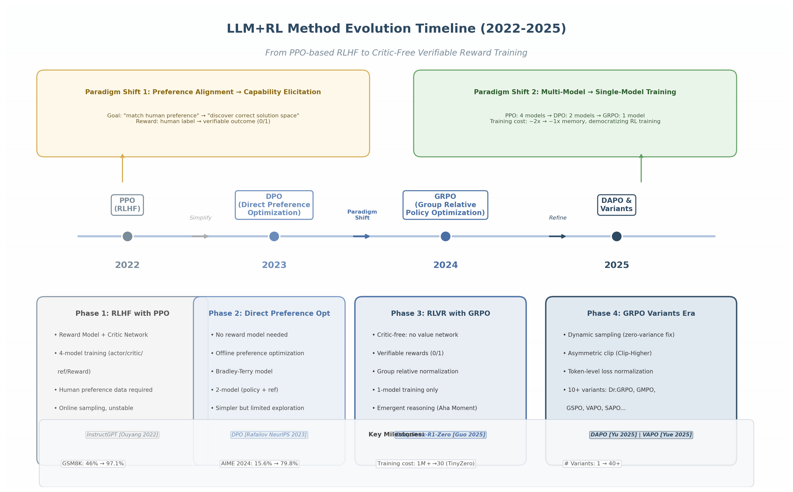

## 1. 研究概述与方法演进全景

### 1.1 研究背景与范围

大语言模型（Large Language Model, LLM）与强化学习（Reinforcement Learning, RL）的结合，正经历自Transformer架构问世以来最为深刻的范式变革。2022年至2025年间，该领域从基于人类反馈的强化学习（Reinforcement Learning from Human Feedback, RLHF）——需要耗资巨大的奖励模型（Reward Model, RM）标注与多阶段训练——演进至仅需单一模型、可验证奖励即可驱动的高效训练范式，催生了从1.5B到671B参数规模均可适用的统一RL框架。

本研究系统调研了2024-2025年发表于NeurIPS、ICML、ICLR、ACL等顶级会议与arXiv预印本平台上的120余篇LLM+RL论文，覆盖10个核心研究维度：核心算法（PPO、DPO、GRPO及其变体）、过程奖励模型（Process Reward Model, PRM）、基于可验证奖励的RL训练（RLVR）、自博弈（Self-Play）、Agent RL训练、Benchmark评估体系、训练框架优化、多目标对齐、课程学习以及小模型RL与推理时计算扩展。调研的核心目标是回答：**在LLM+RL领域，什么方法在什么Benchmark上、以怎样的训练配置取得了何种效果？**

研究范围尤其关注GRPO（Group Relative Policy Optimization, 组相对策略优化）及其变体算法如何在18个月内快速迭代，形成包含DAPO、Dr.GRPO、GMPO、GSPO、VAPO、SAPO等十余种变体的方法家族 [^1^][^2^][^4^][^5^][^6^]，以及RLVR范式从DeepSeek-R1-Zero到业界广泛采纳的完整过程。

### 1.2 方法演进脉络

LLM+RL方法的演进可清晰划分为三个阶段，每个阶段在算法复杂度上呈递减趋势，更在核心目标上发生了从"对齐人类偏好"到"激发模型能力"的根本性转向。

**图1.1** LLM+RL方法演进全景时间线（2022-2025），涵盖从PPO-based RLHF到DPO直接偏好优化，再到GRPO critic-free训练及DAPO变体优化的技术脉络。上半部分标注两大范式转变：从偏好对齐到能力激发、从多模型到单模型训练。

#### 1.2.1 Phase 1 (2022-2023): RLHF with PPO——多阶段训练的奠基时代

2022年，OpenAI发布的InstructGPT奠定了RLHF标准流程：通过监督微调（SFT）学习指令遵循能力，训练奖励模型学习人类偏好，最后使用近端策略优化（Proximal Policy Optimization, PPO）优化策略。该流程需同时维护四个模型——策略网络（Actor）、价值网络（Critic）、参考模型（Reference）和奖励模型（Reward Model）——显存需求约为策略模型的两倍，且PPO的超参数敏感性问题使得训练 notoriously 不稳定 [^14^]。尽管工程复杂度高，PPO-based RLHF在2022-2023年间确立了LLM后训练的标准范式。

#### 1.2.2 Phase 2 (2023-2024): 直接偏好优化DPO系列——去奖励模型的简化路径

2023年NeurIPS上，Rafailov等人提出的直接偏好优化（Direct Preference Optimization, DPO）从根本上改变了格局。DPO的核心洞察在于：KL约束下的奖励最大化问题的最优解与奖励函数之间存在闭式关系，可将偏好学习直接转化为策略上的二分类问题，完全消除奖励模型 [^1^]。DPO的成功催生了2024年密集的改进工作：IPO通过平方损失解决过拟合问题 [^326^]；SimPO完全移除参考模型，在AlpacaEval 2上取得40.2%的LC Win Rate [^240^]；KTO仅需二元反馈信号即可对齐 [^149^]；ORPO将SFT与偏好对齐合并为单阶段训练 [^148^]。这些变体推动了从"四模型训练"到"单模型训练"的技术精简。然而，ICML 2024的全面比较研究表明，PPO在需要强探索的复杂任务（如代码生成）上仍优于DPO [^193^]，预示了在线探索能力在后续推理RL阶段的重要性。

#### 1.2.3 Phase 3 (2024-2025): RLVR with GRPO——Critic-Free的可验证奖励训练

2024至2025年初，LLM+RL领域经历了第二次根本性范式转变。DeepSeek-AI提出的GRPO算法 [^1^]及随后在DeepSeek-R1-Zero上的成功 [^13^]，标志着RLVR（Reinforcement Learning with Verifiable Rewards）范式的正式确立。与RLHF使用人类偏好作为信号不同，RLVR使用可自动验证的结果正确性作为奖励（如数学答案、代码测试结果），奖励值仅为0或1。GRPO通过组内相对奖励归一化消除PPO中的Critic网络：对每个问题采样$G$个回答（通常$G=64$），将组内奖励标准化后作为优势函数，$\hat{A}_{i,t} = (r_i - \text{mean}(\{r_i\})) / \text{std}(\{r_i\})$ [^1^]。

DeepSeek-R1-Zero从671B参数的DeepSeek-V3-Base直接进行大规模RL训练，在AIME 2024上从基线15.6%跃升至71.0%（Pass@1），通过多数投票可达86.7% [^13^]。训练过程中模型自发涌现出长链推理、自我验证、反思乃至拟人化的"Aha Moment"——这些能力并非SFT显式教授，而是纯RL从预训练知识中"挖掘"出来的。GRPO的极简架构配合vLLM等高效推理引擎，使训练成本大幅降低：TinyZero以不到$30在1.5B模型上复现推理涌现 [^3^]，Open-RS以$42在1.5B模型上达到AIME 46.7% [^11^]。DAPO通过动态采样、非对称裁剪Clip-Higher、Token级损失归一化四项改进，将Qwen2.5-32B推至AIME 2024的50分，仅需GRPO 50%训练步数 [^2^]。

下表系统对比三个演进阶段的核心方法。

| 维度 | Phase 1: PPO (2022-2023) | Phase 2: DPO (2023-2024) | Phase 3: GRPO/RLVR (2024-2025) |
|:---|:---|:---|:---|
| 核心算法 | PPO (在线策略梯度) | DPO (离线偏好优化) | GRPO/DAPO (组相对归一化) |
| 奖励来源 | 人类偏好/奖励模型 | 成对偏好数据 | 可验证结果正确性 (0/1) |
| Critic网络 | 需要单独训练 | 不需要 | 不需要 |
| 所需模型数 | 4 (actor/critic/ref/RM) | 2 (policy + ref) | 1 (policy only) |
| 显存开销 | ~2x策略模型 | ~1.5x策略模型 | ~1x策略模型 |
| 核心优势 | 探索能力强，复杂任务优 | 简单稳定，工程友好 | 极简高效，推理涌现 |
| 主要局限 | 不稳定，资源密集 | 探索受限，长度偏差 | 零方差组，熵崩塌 |
| 代表Benchmark | AlpacaEval, HH-RLHF | MT-Bench, Arena-Hard | AIME, MATH-500, LiveCodeBench |
| 标志性成果 | InstructGPT [^14^] | DPO [^1^] | DeepSeek-R1-Zero [^13^] |

上表揭示了LLM+RL方法演进的两条核心主线。**第一条是架构精简线**：从PPO的四模型协同到DPO的两模型离线优化，再到GRPO的单模型极简训练，显存开销从约2倍降至约1倍。这反映了领域对RL在LLM场景中"真正需要什么组件"的深层认知迭代——DPO证明奖励模型可被隐式参数化，GRPO进一步证明价值网络可被组内统计量替代。**第二条是奖励信号范式转移线**：从模拟人类判断到验证客观正确性，这一转变使模型得以探索超出人类示范的解题路径，R1-Zero中涌现的反思行为正是这一自由度的直接产物。

下表从阶段特征角度进一步对比三个演进阶段。

| 特征维度 | Phase 1 (2022-2023) | Phase 2 (2023-2024) | Phase 3 (2024-2025) |
|:---|:---|:---|:---|
| **核心目标** | 对齐人类偏好 | 简化偏好优化流程 | 激发推理能力 |
| **数据类型** | 人类排序的偏好对 | 成对/二元偏好数据 | 带可验证答案的问题 |
| **数据规模** | 数万至数十万偏好对 | 数万偏好对 | 数千至数万个问题 |
| **评估指标** | 胜率, MT-Bench | LC Win Rate, Arena-Hard | Pass@1, 多数投票 |
| **训练成本** | 百万美元级 | 十万美元级 | 数十至数千美元 |
| **关键技术** | GAE, KL penalty | Bradley-Terry, 闭式奖励 | 组采样, 动态过滤, Clip-Higher |
| **超参数敏感度** | 高 | 中 | 低 (组大小G, 学习率) |
| **开源框架** | DeepSpeed, Megatron | TRL, LLaMA-Factory | VERL, AReaL, OpenRLHF |
| **社区复现难度** | 高 | 中 | 低 |

这一对比揭示了引人注目的"Less is More"趋势。Phase 3在模型组件和数据需求上均呈反向收缩——数千个可验证问题即可激发强大推理能力，训练成本从百万美元级降至数十美元级（TinyZero不到$30）[^3^]，社区复现难度大幅降低。Open-R1、SimpleRL-Zoo、TinyZero等开源项目于2025年初集中涌现，标志LLM+RL训练正从大型机构专属能力转变为全球研究社区可广泛参与的技术实践。评估体系也经历显著变迁：Phase 1-2依赖偏好模型的自动化胜率判断，存在长度偏差 [^99^]；Phase 3转向客观正确率评估，但GSM8K已达97.1%饱和，AIME每年仅30题的有限规模也带来新挑战。

### 1.3 研究核心发现概览

#### 1.3.1 从"偏好对齐"到"能力激发"的根本性范式转变

本研究最核心的发现是LLM+RL正经历从"对齐人类偏好"到"激发模型内在能力"的根本性范式转变。传统RLHF使模型输出符合人类偏好判断——本质上是主观的、基于模仿的。RLVR通过可验证奖励引导模型探索正确解空间——信号是客观的、基于发现的。DeepSeek-R1-Zero中涌现的反思、多解法尝试等行为表明，RL可从预训练模型中挖掘潜藏能力，"推理能力"可能并非新教给模型，而是通过RL从已有知识中激发出来的。

#### 1.3.2 GRPO及其变体正在成为事实上的训练标准

交叉验证数据表明，GRPO及其变体已形成LLM+RL推理训练的事实标准。从DeepSeek-R1（671B）到Open-RS（1.5B），主流推理模型在后训练阶段均采用GRPO或其衍生算法 [^1^][^2^][^5^][^6^]。框架层面，VERL（2.77x加速）、AReaL（完全异步架构）等已全面以GRPO为核心 [^327^]。2024-2025年间GRPO变体爆发式增长，本研究梳理超40种变体，涵盖偏差修正（Dr.GRPO）、稳定性增强（GMPO、SAPO）、效率优化（DAPO）和价值模型回归（VAPO，在Qwen-32B上达AIME 2024的60.4分SOTA [^6^]）等方向。超参数调优也因GRPO简洁架构而大幅简化。

#### 1.3.3 "Less is More"——中等难度样本的RL数据效率悖论

与传统深度学习"更多数据=更好性能"的直觉相反，LLM+RL中的数据筛选研究表明，少量高质量样本往往优于全量训练。LIMR仅使用16% curated数据即超越全量训练 [^4^]，FastCuRL减少50%以上训练步骤同时提升性能。SPEED-RL验证通过率约0.5的样本提供最大梯度信号——样本太容易（通过率≈1）或太难（通过率≈0）时，模型无法获得有效学习信号 [^4^]。这一悖论在RLVR中尤为突出：R1-Zero仅需数千个可验证问题即可激发强大推理能力，而传统RLHF通常需数十万偏好对。RL训练数据构建正从"大规模采集"转向"精心策划"，自动化难度评估和动态筛选正在成为标准步骤。
