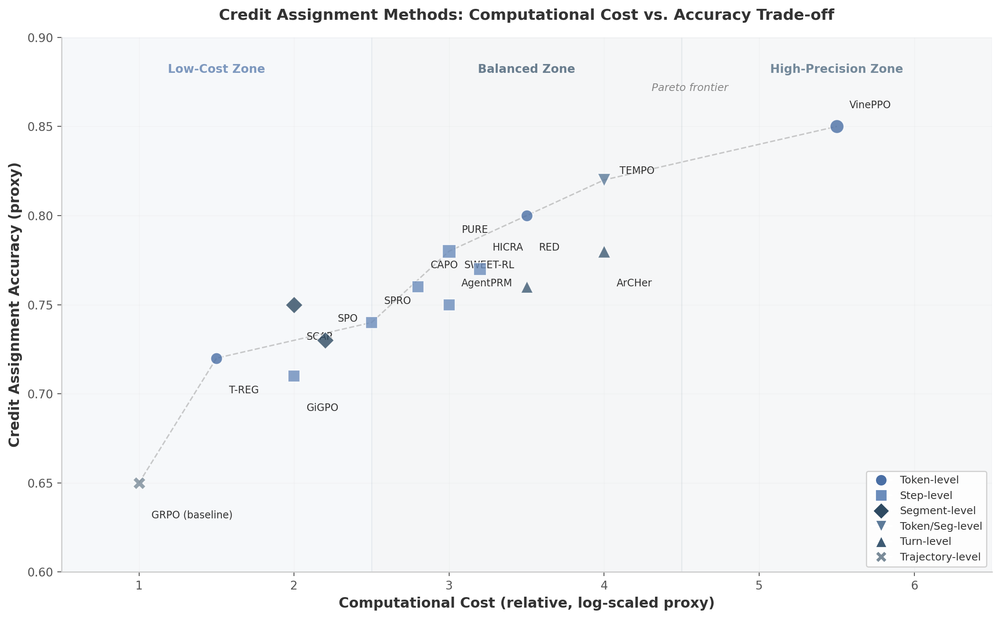

## 3. 过程奖励模型与信用分配

信用分配（Credit Assignment, CA）是LLM强化学习训练中的核心机制。当模型生成长达30K tokens的推理链时，最终答案的正确或错误必须被精确归因到序列中的各个位置——是初始理解错误，还是中间某步计算失误，抑或仅是最终表达疏忽？这一归因过程的精确度直接决定了策略梯度更新的有效性。研究表明，在单轮推理中信用分配已趋于成熟，而在多轮Agent交互中仍面临随机环境、部分可观察性和非可验证中间状态等根本性挑战 [^1^]。

### 3.1 过程监督基础

#### 3.1.1 PRM vs ORM：从结果到过程的范式转移

过程奖励模型（Process Reward Model, PRM）与结果奖励模型（Outcome Reward Model, ORM）的分野构成了LLM强化学习信用分配研究的方法论起点。PRM对推理链的每一步输出一个标量奖励信号，而ORM仅对最终答案进行评估。OpenAI在2023年发表的"Let's Verify Step by Step"通过人工标注80万步级标签构建了PRM800K数据集，首次以大规模实验证明PRM在best-of-K选择中显著优于ORM（78.2% vs 72.4% vs 69.6%多数投票），奠定了过程监督的实证基础 [^2^] [^24^]。

**表1：PRM与ORM核心属性对比**

| 维度 | ORM（结果奖励模型） | PRM（过程奖励模型） |
|:---|:---|:---|
| 监督粒度 | 仅评估最终答案 | 每步/每token评估 |
| 标注成本 | 低（仅需最终结果标签） | 高（需步级标签，人工约$1-2/步 [^5^]） |
| 信用分配密度 | 稀疏，延迟反馈 | 密集，即时反馈 |
| 奖励黑客风险 | 较低 | 较高（可能优化表面正确性） |
| 推理可解释性 | 低（无法定位错误） | 高（可精确到错误步） |
| 测试时扩展能力 | 弱（仅选最终答案） | 强（可引导搜索/剪枝） |
| 适用场景 | 短推理、可验证任务 | 长推理、多步复杂任务 |
| 代表方法 | GRPO、PPO | PURE、VinePPO、SPO |

PRM的优势在需要长链推理的竞赛级数学问题上尤为突出：PRM能够引导树搜索中的剪枝决策，因其步级信号可以识别并排除错误分支 [^6^]。然而，PRM的高标注成本长期制约其扩展性——人工标注每步正确性的成本约为最终结果标注的50-75倍 [^5^]。ORM虽然在简单任务上表现足够，但当推理链超过一定长度时，稀疏的终端反馈无法为中间步骤提供有效的学习信号。值得指出的是，DeepSeek-R1的实验表明纯ORM配合大规模RL训练也能激发强推理能力，这意味着PRM并非必要条件，而是在特定场景下提升训练效率和最终性能的有力工具 [^1^]。

#### 3.1.2 自动化标注：Math-Shepherd与OmegaPRM

PRM标注成本问题的首个系统性解决方案来自Math-Shepherd（ACL 2024）。该方法对每个推理步骤进行蒙特卡洛（Monte Carlo, MC）采样：从当前步出发独立采样多条后续轨迹，计算到达正确答案的比例作为该步的过程监督分数 [^3^]。Math-Shepherd以Mistral-7B为基座模型，在GSM8K和MATH基准上验证了自动标注PRM的可行性，但其采样成本仍然较高——每步需数十条完整rollout才能获得稳定的估计。

OmegaPRM（2024）通过引入分治式蒙特卡洛树搜索（MCTS）结合二分搜索策略，显著降低了标注开销。该方法将定位推理链中首个错误步的问题建模为树搜索过程，通过优先探索高不确定性区域，在保持标注质量的同时将成本降低约75倍 [^4^] [^5^]。OmegaPRM使用Gemini Pro模型自动生成超过150万过程监督标注，将MATH500上的表现从51%提升至69.4%，GSM8K达到93.6% [^4^]。AlphaMath（2024）则采用了更为激进的策略——从结果监督直接推导伪过程监督标签，完全消除了步级标注需求，但引入了标注噪声与推理质量之间的权衡 [^2^] [^25^]。

#### 3.1.3 隐式PRM：PRIME的在线学习路径

PRIME（Process Reinforcement through Implicit Rewards, 2025）代表了一种根本不同的PRM构建思路：无需任何显式过程标注，而是从策略模型和参考模型的对数似然比中推导token级别的密集奖励 [^10^]。其隐式过程奖励定义为 $r_\phi(y_t) := \beta \log \frac{\pi_\phi(y_t|y_{<t})}{\pi_{ref}(y_t|y_{<t})}$，即策略模型与参考模型在生成每个token时的概率差异。PRIME的核心优势在于策略和隐式PRM可以同时在线更新：策略通过强化学习优化，PRM通过交叉熵损失更新，两者仅需结果级标签驱动。实验表明，从Qwen2.5-Math-7B-Base出发，PRIME在多个数学和代码推理基准上平均提升15.1%，训练出Eurus-2-7B-PRIME模型 [^10^]。PRIME开创了隐式信用分配（Implicit Credit Assignment, ICA）的研究方向，为后续FreePRM和ThinkPRM等工作奠定了理论基础。

### 3.2 信用分配方法全景

信用分配方法可按监督粒度划分为四个层级：token-level、step-level、segment-level和turn-level。每个层级在计算开销与估计精度之间存在根本性权衡，适用于不同的任务场景和计算约束。

**表2：信用分配方法粒度分类全景**

| 方法 | 粒度 | 核心机制 | 需辅助模型 | 计算开销 | 精度 | 场景 |
|:---|:---|:---|:---|:---|:---|:---|
| VinePPO [^13^] | Token | 无偏MC价值估计：每token分叉K条vine rollout | 否 | 高（$O(K \cdot L)$） | 最高 | 长推理链 |
| RED [^14^] | Token | 从RM隐藏层提取token级边际贡献 | 需RM | 低（零额外RL成本） | 高 | 已有RM复用 |
| T-REG [^15^] | Token | 对比自提示生成正确/错误解的log-prob差异 | 否 | 低 | 中 | 偏好优化 |
| TEMPO [^16^] | Token/Seg | Prefix-to-Tree + branch-gated TD修正 | 否 | 中 | 高 | 短/长CoT |
| PURE [^9^] | Step | Min-form $V(s_t)=\min r_\tau$ 替代求和 | 需PRM | 中 | 高 | 竞赛数学 |
| SPRO [^17^] | Step | 从策略本身推导CPR+MSA，critic-free | 否 | 中 | 中高 | 工业部署 |
| CAPO [^26^] | Step | LLM-as-Critic生成式PRM自我批评 | 需LLM | 中 | 中 | 自包含系统 |
| ACPO [^27^] | Step | 梯度归因分解结果奖励为步级贡献 | 否 | 中 | 中 | 课程学习 |
| HICRA [^28^] | Step | 关注高影响力规划token的两阶段动态 | 否 | 中 | 中高 | 复杂推理 |
| SPO [^18^] | Segment | MC段级优势估计（chain/tree双实例） | 否 | 中 | 中高 | 通用推理 |
| SCAR [^19^] | Segment | Shapley值从合作博弈论分配边际贡献 | 否 | 高 | 高 | 通用RLHF |
| ArCHer [^29^] | Turn | 两级架构：高级off-policy critic + 低级on-policy actor | 需Critic | 中 | 中 | 多轮Agent |
| GiGPO [^20^] | Step | 两级优势：外层轨迹比较+内层anchor分组 | 否 | 低 | 中 | Agent训练 |
| SWEET-RL [^30^] | Turn | Privileged critic条件于训练时特权信息 | 需Critic | 中 | 中高 | 多轮交互 |
| AgentPRM [^21^] | Step | TD+GAE替代MC，promise+progress双评分 | 需Critic | 中 | 中高 | 工具使用Agent |

上表涵盖了从token到turn的全谱系方法。关键观察有三：其一，critic-free方法（T-REG、SPRO、GiGPO、SPO、SCAR）在2025年密集涌现，反映了工业界对低部署成本方案的强烈需求；其二，step-level方法数量最多（PURE、SPRO、CAPO、ACPO、HICRA），表明该粒度在精度与实用性之间取得了最佳平衡；其三，Agent-level方法普遍需要辅助模型（critic或privileged信息），因为多轮交互中的部分可观察性使无模型估计面临根本性困难 [^1^]。

#### 3.2.1 Token-level信用分配：最细粒度的无偏估计

VinePPO（ICML 2025）是token-level信用分配的理论最优美实现。其核心机制是在每个token位置分叉 $K$ 条独立continuation（称为"vine"），评估每条路径的最终奖励，以此构建无偏的token级价值估计：$V(s_t) \approx \frac{1}{K} \sum_{k=1}^{K} R(\tau_t^{(k)})$ [^13^]。优势函数 $\hat{A}_t = R(\tau) - V(s_t)$ 消除了critic函数逼近误差，每个token的信用完全由其后续多条路径的期望回报决定。然而，这种精确性以 $O(K \cdot L)$ 的额外前向传播为代价（$L$ 为序列长度），在长推理链上计算成本急剧上升。VinePPO的关键实证发现是：信用分配质量（而非策略优化算法本身）才是RL训练的主要瓶颈 [^1^]。

RED（Reward Redistribution, 2024）采取了截然不同的路径：从现成的奖励模型（Reward Model, RM）内部表示中提取token级奖励。具体而言，RED在RM的隐藏状态上训练一个轻量级线性probe，预测每个token对总奖励的边际贡献 [^14^]。这种方法的计算成本近乎为零——仅需一次额外的前向传播即可完成所有token的信用重分配。RED的核心发现是预训练奖励模型已编码了丰富的信用分配信息，只是未被充分利用 [^14^]。

TEMPO（2025）提供了一种介于token-level与segment-level之间的混合方案。其Prefix-to-Tree（P2T）模块将一组响应转换为前缀树结构，通过聚合所有后代节点的结果正确性计算非参数化前缀值 $V(s_t)$ [^16^]。Branch-gated TD修正在非分支token处退化为标准GRPO（TD项为零），仅在分支token处提供精确的token-level信用修正。这一设计使TEMPO无需学习价值网络、PRM或额外judge，在Qwen3-1.7B/4B上收敛速度比PPO和GRPO提升高达1.6倍 [^16^]。

#### 3.2.2 Step-level信用分配：实用性与精度的平衡

Step-level信用分配是当前研究最活跃的粒度区间，因其在标注可行性与信用精度之间取得了实际平衡。

PURE（ICML 2025）通过数学洞察解决了PRM训练中的一个根本性问题。传统PRM将价值函数定义为未来奖励之和 $V(s_t) = \sum_{\tau \geq t} r_\tau$，PURE证明这种求和形式（summation-form）会导致训练初期即出现崩溃（reward hacking）——模型可通过增加正确步数来无上限提升价值估计 [^9^]。PURE提出的min-form信用分配将价值函数重新定义为 $V(s_t) = \min_{\tau \geq t} r_\tau$，即后续步骤中的最小奖励。这一看似简单的改变从根本上限制了价值函数的范围，使优势分配更加合理。实验表明，PURE-PRM仅需30%训练步数即可达到与可验证奖励（VR）方法相当的推理性能，而PURE-PRM+VR（仅10%可验证奖励）在AMC23上达到82.5%、五个基准平均53.3% [^9^]。

CAPO（Credit Assignment Policy Optimization, 2025）开创了LLM-as-Critic范式：利用LLM自身的语义理解能力，给定推理轨迹后生成每步的自然语言批评，再将其转化为数值奖励信号 [^26^]。CAPO的优势在于完全自包含——无需单独的奖励模型、critic网络或MC rollout，但面临自我评估偏差（模型系统性高估自己步骤）的风险，需配合校准技术使用。在Qwen2.5-7B上，CAPO在MATH-500上达到31.0%（相比GRPO的27.2%提升3.8个百分点），在AIME'24上达到9.7%（相比GRPO的3.6%提升6.1个百分点）[^1^]。

HICRA（Hierarchy-Aware Credit Assignment, 2025）通过识别学习的两阶段动态来优化信用分配：模型首先获得程序性技能（常规计算模式），然后发展策略规划能力（高层问题分解）。HICRA据此将学习信号集中于高影响力规划token，而非均匀分配至所有token [^28^]。在Qwen3-4B-Instruct上，HICRA在AIME'24达到73.1%（比GRPO的68.5%提升4.6个百分点），AIME'25达到65.1%（比GRPO的60.0%提升5.1个百分点）[^28^]。

#### 3.2.3 Segment-level信用分配：中间粒度的系统设计

SPO（Segment Policy Optimization, 2025）是segment-level信用分配的代表性工作，其核心设计包含三个组件：灵活的segment分区策略、精确的segment级MC优势估计（无需critic）、以及基于segment优势的策略优化 [^18^]。SPO提供两个实例化版本：SPO-chain针对短CoT采用cutpoint-based分区配合chain-based优势估计，在GSM8K上比PPO/GRPO提升6-12个百分点；SPO-tree针对长CoT采用tree-based优势估计，大幅降低MC估计成本，在MATH500上比GRPO提升7-11个百分点。使用DeepSeek-R1-Distill-Qwen-1.5B模型，SPO在MATH-500（4K上下文）上达到82.8%，相比GRPO的75.2%提升7.6个百分点 [^18^]。

SCAR（Shapley Credit Assignment Rewards, 2025）从合作博弈论出发，使用Shapley值原理将序列级总奖励按各token/span的边际贡献进行分配 [^19^]。Shapley值的理论保证使SCAR在保持原始最优策略不变的前提下实现更公平的信用分配，无需辅助critic模型或细粒度人工标注。SCAR在情感控制、文本摘要和指令调优任务上相比标准RLHF和基于attention的dense reward基线收敛更快且最终奖励更高 [^19^]。

#### 3.2.4 Agent-level信用分配：多轮交互的分层架构

Agent-level信用分配面向多轮交互场景（如工具使用、网页导航），其中信用粒度以"轮次"（turn）为单位，一轮可包含数百至数千个token。这一层级的核心挑战来自部分可观察性和环境交互的不可重复性。

ArCHer（ICML 2024）是首个面向多轮LLM Agent的分层信用分配架构，采用显式两级设计：高级off-policy critic学习轮次级Q函数 $Q^H(s_t, a_t)$，低级on-policy actor优化轮次内的token级策略 $\pi_\theta(y|s_t)$ [^29^]。高级critic从经验回放缓冲区中学习，低级actor则以高级Q值作为轮次级奖励信号进行优化。ArCHer的架构正式认识到多轮LLM强化学习与单轮推理强化学习在信用分配机制上需要根本不同的设计 [^1^]。

GiGPO（NeurIPS 2025）将GRPO的组比较原则从轨迹级扩展到步级，是当前Agentic RL中最先进的critic-free方法。其两级优势估计在**外层**对轨迹进行分组比较（如标准GRPO），在**内层**通过anchor state grouping将共享相似前缀的步骤分组进行微观比较 [^20^]。GiGPO保持了GRPO的critic-free特性，GPU内存开销与GRPO相同，无额外LLM rollout时间成本。在ALFWorld上比GRPO提升超过12个百分点，WebShop上提升超过9个百分点 [^20^]。

SWEET-RL（Meta/FAIR, 2025）引入了**特权critic**（privileged critic）的概念，利用训练时可获得但推理时无法获取的信息（ground truth答案、完整未来轨迹、环境状态变量）训练critic，使其提供高质量的轮次级奖励信号 [^30^]。actor则通过DPO式优化仅看到标准观测。这一设计优雅地绕过了中间状态不可验证的挑战，在多轮交互任务上展示了显著优势。

AgentPRM（2025）证明在Agent环境中MC标注过于昂贵——每次标注都需要重新执行环境交互。其替代方案是使用TD学习配合GAE训练步级critic：$V(s_t) \leftarrow V(s_t) + \alpha[r_t + \gamma V(s_{t+1}) - V(s_t)]$，并引入"promise"（成功可能性）和"progress"（步间进展）双评分机制。AgentPRM比MC-based PRM训练高出8倍样本效率 [^21^]。

**图1：信用分配方法的计算开销与精度权衡**。横轴为计算成本相对值（以对数代理度量），纵轴为信用分配精度代理值。不同形状代表不同粒度层级（圆圈=token级，方块=step级，菱形=segment级，三角=turn级）。帕累托前沿线（虚线）连接了各计算预算下的最优方法。GRPO作为基线位于左下角，VinePPO位于右上角。值得注意的是，step-level方法（如PURE、SPRO）在平衡区密集分布，反映了该粒度区间在精度与开销之间的最优折中；而critic-free方法（T-REG、SPRO、GiGPO）虽然精度略低，但部署成本优势使其在工业场景中更具吸引力。

### 3.3 自动化过程标注新进展

尽管PRM在理论上优于ORM，但过程标注的获取成本长期制约其规模化应用。2025年涌现的FreePRM和ThinkPRM系列工作通过弱监督和生成式验证两大路径，显著降低了PRM训练的标注门槛。

**表3：自动化过程标注方法对比**

| 方法 | 年份 | 需人工标注 | 标注质量 | 计算成本 | 核心思想 | 关键局限 |
|:---|:---|:---|:---|:---|:---|:---|
| Math-Shepherd [^3^] | 2024 | 否 | 中（MC估计噪声） | 高（每步数十条rollout） | MC采样估计步正确性 | 采样方差大 |
| OmegaPRM [^4^] | 2024 | 否 | 中高（MCTS优化） | 中（MCTS+二分搜索） | 分治式MCTS定位首错步 | 依赖可验证环境 |
| AlphaMath [^25^] | 2024 | 否 | 低-中（伪标签噪声） | 低 | 从结果监督推导伪过程监督 | 噪声与质量权衡 |
| PRIME [^10^] | 2025 | 否 | 中（隐式推导） | 极低（在线推导） | 策略-参考模型log-likelihood比 | 依赖参考模型质量 |
| FreePRM [^12^] | 2025 | 否 | 中（弱监督） | 低 | 结果正确性生成伪过程标签 | 标签精度上限 |
| ThinkPRM [^11^] | 2025 | 是（仅1% PRM800K） | 高（生成式验证） | 极低 | CoT验证链后再判断 | 需少量种子标注 |
| AURORA | 2025 | 否 | 中 | 低 | 集成提示+反向验证 | 通用性待验证 |

自动化标注方法的发展呈现清晰的演进轨迹：从Math-Shepherd的高成本MC采样，到OmegaPRM的MCTS优化，再到PRIME的完全隐式推导，标注成本持续下降而质量逐步提升。ThinkPRM（2025）代表了生成式验证的前沿方向：训练PRM在做出判断之前先生成验证链式思维（verification chain-of-thought），利用长CoT模型的推理能力进行步级验证。ThinkPRM仅需PRM800K中1%的过程标签（约8000步），即在ProcessBench上超越使用完整PRM800K训练的判别式PRM，在分布外任务上优势更为明显（GPQA提升8个百分点，LiveCodeBench提升4.5个百分点）[^11^]。此外，在相同token预算下，ThinkPRM比LLM-as-a-Judge方法高出7.2%，且可通过扩展验证计算持续提升性能 [^11^]。

FreePRM（2025）则探索了完全无需真实过程标签的弱监督路径，仅使用结果正确性生成伪过程标签训练PRM。尽管标签噪声较高，FreePRM在ProcessBench上达到平均F1分数53.0%，超越使用Math-Shepherd全量数据训练的监督PRM 24.1个百分点 [^12^]。这一结果表明，弱监督信号的规模化利用可能比少量精确标注更具扩展性——契合了"Less is More"在LLM+RL数据策略中的新范式。

PRIME从另一角度解决了标注问题：通过隐式过程奖励将ORM本身转化为PRM。PRIME的奖励函数 $r_\phi(y_t) = \beta \log \frac{\pi_\phi(y_t|y_{<t})}{\pi_{ref}(y_t|y_{<t})}$ 可以在线计算，策略和PRM同步更新，彻底消除了对任何显式标注的需求 [^10^]。PRIME的训练框架为FreePRM和ThinkPRM提供了理论基础——当显式标注不可得时，从策略动态中隐式推导过程信号是一种可行的替代方案。

各信用分配方法在计算开销与精度之间的权衡关系（图1）揭示了当前领域的实践共识：对于计算资源受限的场景，critic-free的step-level方法（SPRO、GiGPO）以较低的部署成本提供了足够的信用精度；对于追求最高推理质量的场景，token-level的VinePPO或TEMPO配合tree-based估计提供了最优的信用分配质量；而对于多轮Agent交互，turn-level的分层架构（ArCHer、SWEET-RL）则是应对超长horizon的合理选择。随着自动化标注技术的进步，PRM的训练门槛正在快速下降——从Math-Shepherd的高成本MC采样到ThinkPRM仅需1%种子标注，信用分配方法的选择将越来越多地取决于任务的固有特性而非标注资源的可用性。
